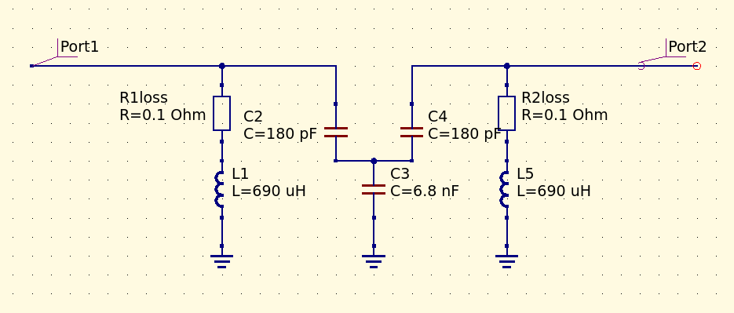

# Transfer matrix simulation of two loosely coupled resonant tank circuits

This is the GNU Octave (MATLAB-alike) simulation of two, loosely coupled LC tank circuits (fc around 455kHz), using the cascaded transfer matrix technique.

```
M = | 1     0 |  x  | 1 Z(c2) |  x  | 1     0 |  x  | 1 Z(c4) |  x  | 1     0 |
    | Y(l1) 1 |     | 0     1 |     | Y(c3) 1 |     | 0     1 |     | Y(l5) 1 |
```



## CLI command under linux with GNU Octave:
`octave ./abcdmaix.m`

## S2,1 results


## From Pozar book


