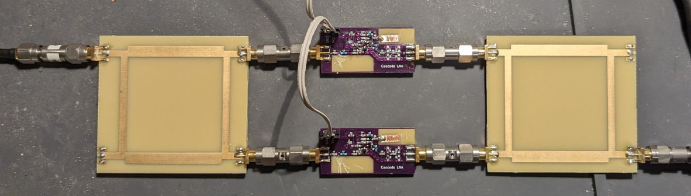
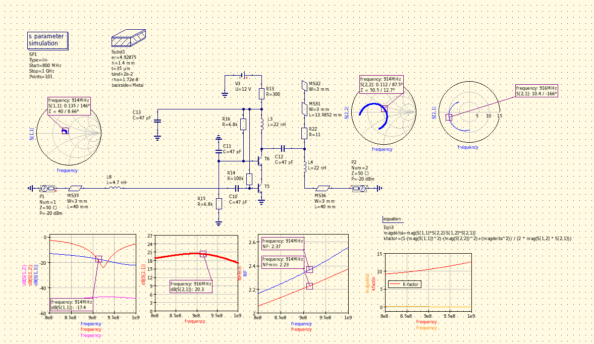
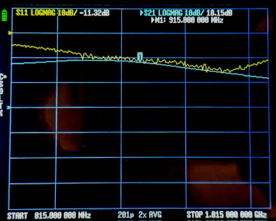

## Balanced amplifier for 915MHz

This design uses a slightly modified version of the [915MHz cascode amp](https://github.com/szoftveres/RF_Microwave/tree/main/Amplifier/cascode) and the [915MHz hybrid](https://github.com/szoftveres/RF_Microwave/tree/main/Microstrip/Hybrid) as building blocks.

Advantages of a balanced amplifier are 3dB more OP1DB headroom, input- and output match being independent of the match to the actual active devices due to the reflected power being absorbed on the (terminated) isolated ports, and redundancy.

It's required however that the individual amplifiers are "identical", i.e. the output phase relative to the input must be the same for both devices, in order for the 90° hybrid to be able to combine the output of both devices.

The individual LNAs have a wideband input match, and tunability (both output peaking and phase matching) is achieved by a tuning stub on the output.

The achieved gain is somewhat lower than the gain of the individual amplifiers, mostly due to the lossy PCB material.

