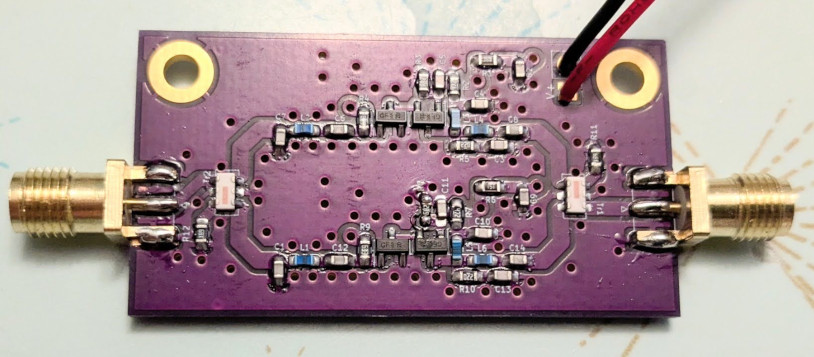
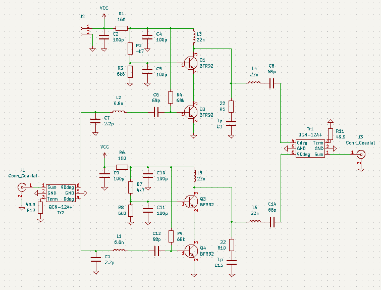
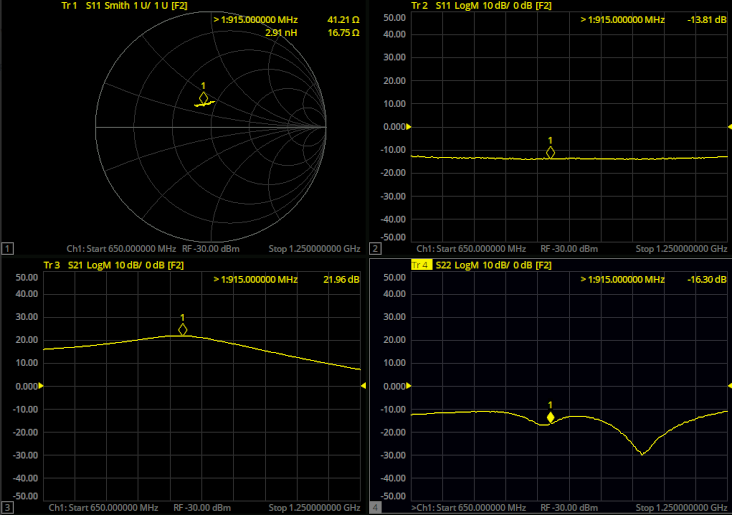
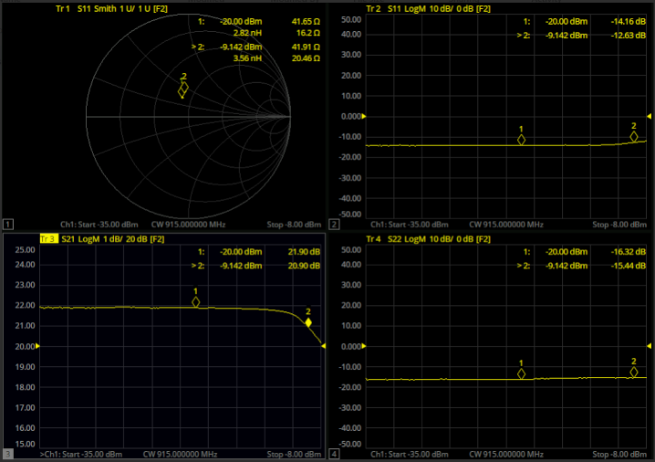

## Balanced amplifier for 915MHz

Two [915MHz Antenna LNAs](https://github.com/szoftveres/RF_Microwave/tree/main/Amplifier/cascode) turned into a balanced amplifier, intended for low power PA and driver use.

### Prototyping

Several built antenna LNAs showed an S2,1 phase difference of no more than 5 degrees, making them a good candidate. Prototyped with the [DIY 915MHz hybrids](https://github.com/szoftveres/RF_Microwave/tree/main/Microstrip/Hybrid):

### Build and measurements

S-parameters:

Power sweep, Pin = -35 dBm - -8 dBm

Gain: +21.9 dB, P1dBin: -9.1 dBm, OP1dB: +11.8 dBm

Current consumption is 20mA (Vcc = +9V)

