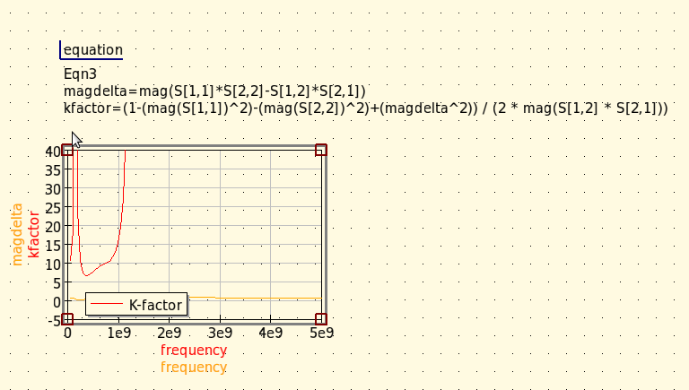
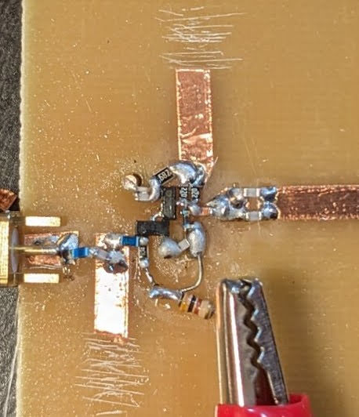
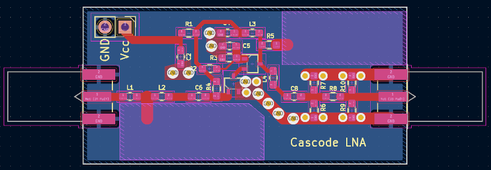
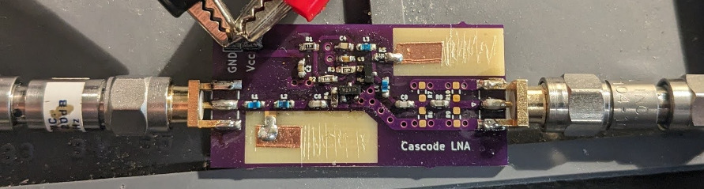
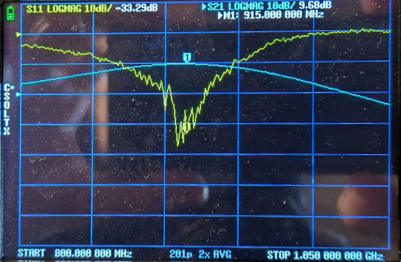
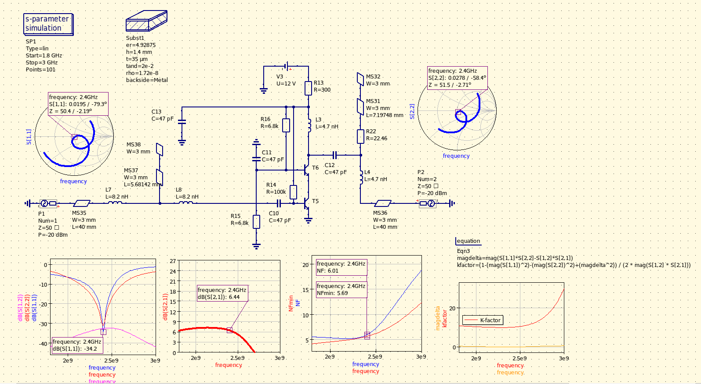
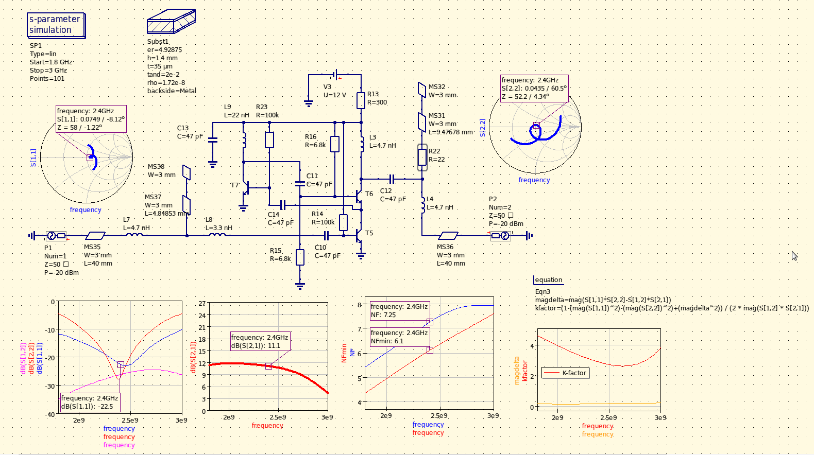

## Cascode BJT LNA for 915MHz

This design is optimized around inductor values that are available to purchase as discrete parts; the matching networks use electrically short microstrip lines as trimmable shunt capacitors.

Input matching is implemented with a high-Q narrow-band T-match, taking advantage of its natural filtering and band-passing effect before the first LNA stage. Output matching is implemented with an L-match; in order to improve stability, artificial resistive loss (R22, 10Ω) was added in series with the shunt capacitance (electrically short microstrip); this degenerates the Q of the matching network at the expense of slight loss of gain, without having significant effect on the noise figure. Reducing the value of this resistance to the point of losing unconditional stability buys another 4dB of gain.

The LNA circuit, with the input T-match tuned for best NF:

With the amplifying devices used in this circuit (Philips/NXP BFR92A, ft = 5GHz) and the degeneration in the output matching, stability is not an issue, the circuit is unconditionally stable throughout the entire operating range of the transistors:

### Noise sources

Besides non-ideal (lossy) inductors in the input T-matching network, the use of electrically short microstrip stub as shunt capacitance - being built on lossy PCB material and being at the highest impedance point of the matching network - introduces around 0.6dB NF degradation versus an ideal (lossless) 1.5pF capacitor.

Without compromising tunability, NF can be improved by around 0.4dB by re-arranging the input to a PI-match and moving the tunable microstrip stub to the lowest impedance point of the input matching network (base of the BJT), at the expense of lower inductor and capacitor values (more uncertainty when using discrete parts) as well as the need for a good ground via for the discrete shunt capacitor (C14 below).

The same circuit re-arranged for PI-match input, showing 0.4dB NF improvement:

  

The bias point for best NF of this transistor is at around 5mA, higher bias current (e.g. for better P1DB) will start degrading the best obtainable NF. 

Also, the input matching is a tradeoff between best match vs. best obtainable NF.

### Non-linearity analysis

Simulated P1DBout is around +6dBm; the 2nd and 3rd harmonics are observable but are heavily suppressed, due to the output matching network being tuned to the fundamental.

  

### Prototyping, build and measurements

T-match input version; the final tuned stub lengths are almost exactly as simulated:

The actual PCB features a resistive PI-attenuator on the output, which is unpopulated (bypassed) in this case. The RF traces are narrower than a standard 50Ω trace, however - being in series with the several tens of nH inductors - their inductance gets absorbed into the input- and output matching networks:

The measured gain (19.68dB, note the added 10dB attenuator on the output) is very close to simulated:

## Adapting for 2.4GHz

At 2.4GHz these transistors (BFR92A) begin to show their limitations in the form of reduced gain and increased noise figure:

With boosted (regulated) cascode topology, around 6dB more gain can be achieved, however stability starts becoming an issue:

