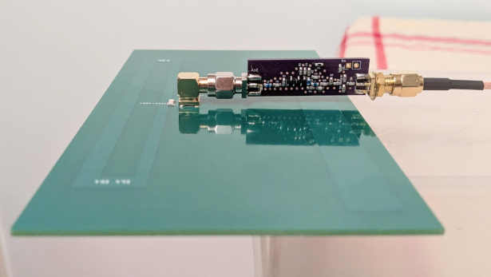

## Antenna amplifier for 915MHz

The intent here was to come up with a discrete low-noie antenna amplifier with robust characteristics, while developing further practical RF/ microwave skills using discrete devices.

The output L-match is formed by L4 indutor, Ccb (output) capacitance of T6 transistor and MS31-MS32 electically short (capacitive) stub. R22 resistor degenerates the L-match, which is necessary for stabilizing the amplifier. Tuning of the output match is done by adjusting the length of the stub.

Initial design, built around discrete BFR92 transistors, with input T-match (tuned for best NF):

### Noise sources

Besides non-ideal (lossy) inductors in the input T-matching network, the use of electrically short microstrip stub as shunt capacitance - being built on lossy PCB material and being at the highest impedance point of the matching network - introduces around 0.6dB NF degradation versus an ideal (lossless) 1.5pF capacitor.

The same circuit re-arranged for PI-match input, showing 0.4dB NF improvement:

  

### Non-linearity

Simulated P1DBout is around +6dBm; the 2nd and 3rd harmonics are observable but are heavily suppressed, due to the output matching network being tuned to the fundamental.

  

### Prototyping, build and measurements

Prototype, with stubs in the in- and output matching networks:

Final build, the input is matched with L-match and the short stub of the output L-match is replaced by C3.
The final build includes a built-in 4 dB output attenuator, mainly in order to create a good transition between the output L-match of the LNA and whatever follows it - a poor cable or connector could de-tune the L-match and potentially de-stabilize the amplifier. The LNA still has plenty of gain, so trading off 4 dB gain and power for extra robustness seemed like a good deal.
Also a bias-tee is included on the final circuit and PCB, enabling the installation of the LNA near the antenna and powering it through the RF coax cable.

The values of C7, L2 and C3 were determined experimentally.

Installed on a [PCB antenna](https://github.com/szoftveres/RF_Microwave/tree/main/em_antenna/915_pcb_yagi) and powered remotely via the RF cable:

S-parameters:

Power sweep, Pin = -35 dBm - -5 dBm

Gain: +18.17 dB, P1dBin: -11.8 dBm, OP1dB: +5.37 dBm

Current consumption is 10mA (Vcc = +9V)

## Balanced amplifier

Several built antenna LNAs showed an S2,1 phase difference of no more than 5 degrees, making them a good candidate for a balanced amplifier design.

Prototyped with the [DIY 915MHz hybrids](https://github.com/szoftveres/RF_Microwave/tree/main/Microstrip/Hybrid):

### Build and measurements

The final build uses off-the-shelf SMD branchline couplers (Mini-Circuits QCN-12A+). The layout of the individual amplifiers on the PCB is identical to the single LNA, in order to preserve their (already characterized) performance, and the in- and out connecting trace lengths are equal.
Since the output L-match of each amplifier is now terminated by the output branchline coupler, the 4 dB attenuators were omitted - the extra 4 dB gain, nearly 7 dB more output power compared to a single LNA and a broadband output match makes this amplifier a good PA driver.

In- and output now appears to be perfectly matched over a broad band - due to the impedance of R11 and R12 being reflected on the input-and output ports.

The amplifier is usable for generic LNA, or driver amplifier applications due to higher output power.

Power sweep, Pin = -35 dBm - -8 dBm

Gain: +21.9 dB, P1dBin: -9.1 dBm, OP1dB: +11.8 dBm

Current consumption is 20mA (Vcc = +9V)

