## Antenna amplifier for 915MHz

The intent here was to come up with a discrete low-noie antenna amplifier with robust characteristics, while developing further practical RF/ microwave skills using discrete devices.

Initial design, built around discrete BFR92 transistors, with input T-match (tuned for best NF):

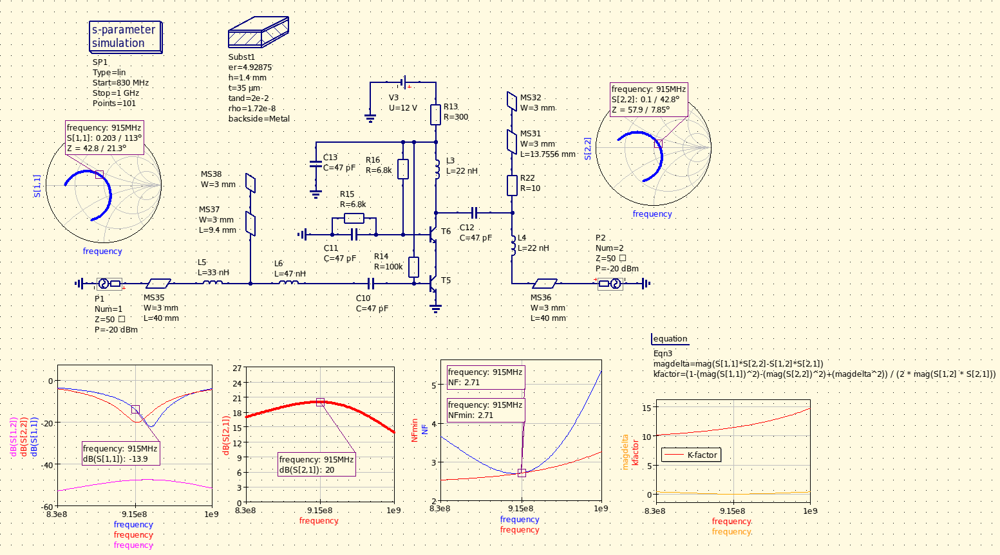

### Noise sources

Besides non-ideal (lossy) inductors in the input T-matching network, the use of electrically short microstrip stub as shunt capacitance - being built on lossy PCB material and being at the highest impedance point of the matching network - introduces around 0.6dB NF degradation versus an ideal (lossless) 1.5pF capacitor.

The same circuit re-arranged for PI-match input, showing 0.4dB NF improvement:

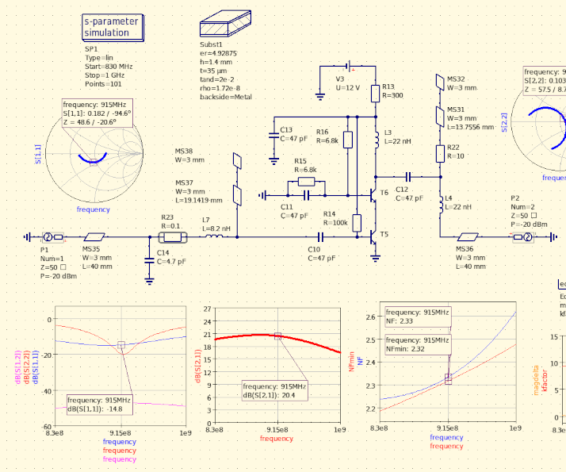  

### Non-linearity

Simulated P1DBout is around +6dBm; the 2nd and 3rd harmonics are observable but are heavily suppressed, due to the output matching network being tuned to the fundamental.

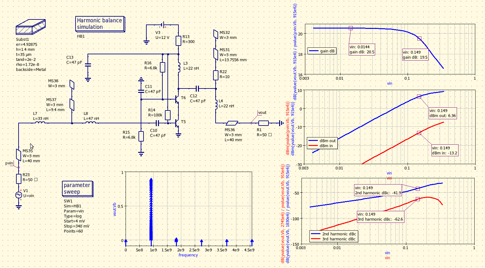  

### Prototyping, build and measurements

Prototype, with stubs in the in- and output matching networks:

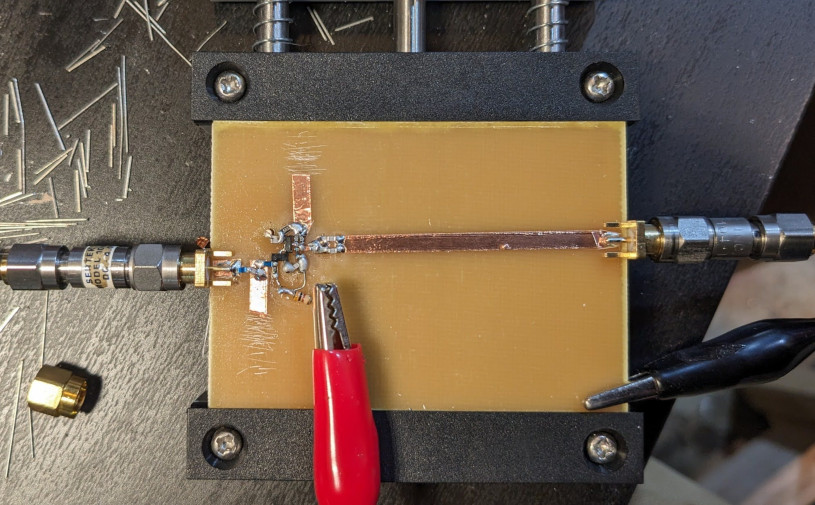

Final build with input L-match, output pad (4dB) and integrated bias-tee:

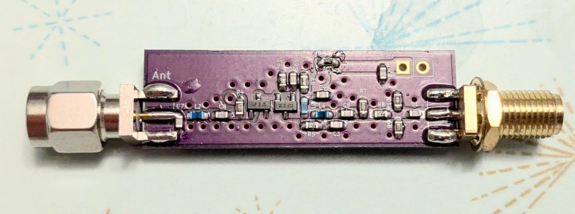

The values of C7, L2 and C3 were determined experimentally:

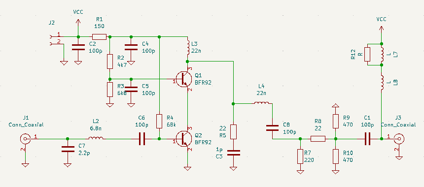

S-parameters:

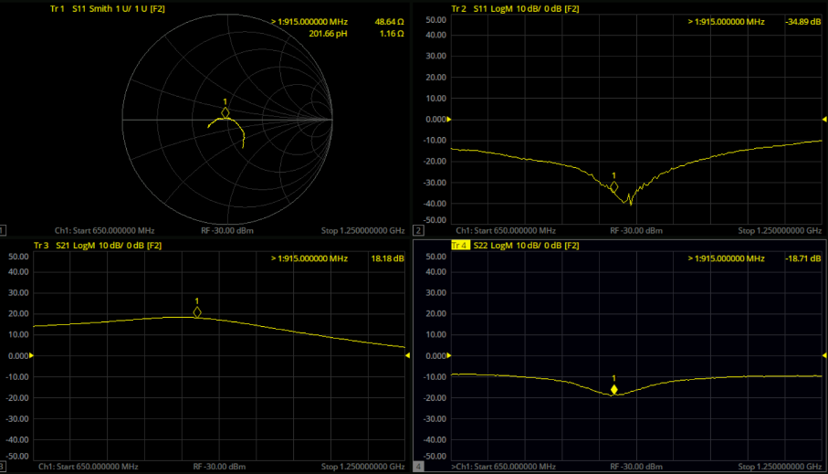

Power sweep, Pin = -35 dBm - -5 dBm

Gain: +18.17 dB, P1dBin: -11.8 dBm, OP1dB: +5.37 dBm

Current consumption is 10mA (Vcc = +9V)

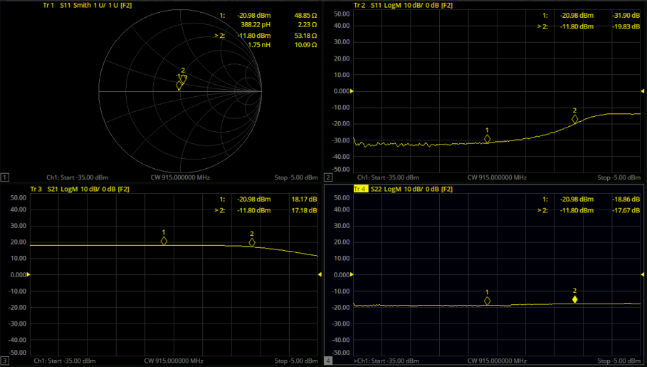

## Balanced amplifier

Several built antenna LNAs showed an S2,1 phase difference of no more than 5 degrees, making them a good candidate for a balanced amplifier design.

Prototyped with the [DIY 915MHz hybrids](https://github.com/szoftveres/RF_Microwave/tree/main/Microstrip/Hybrid):

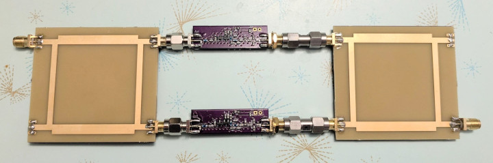

### Build and measurements

The final build uses QCN-12A+ SMD branchline couplers from Mini-Circuits. The layout of the individual amplifiers on the PCB is identical to the single LNA, in order to preserve their (already characterized) performance.

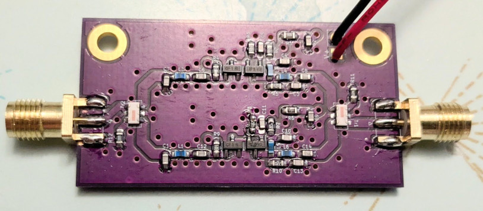

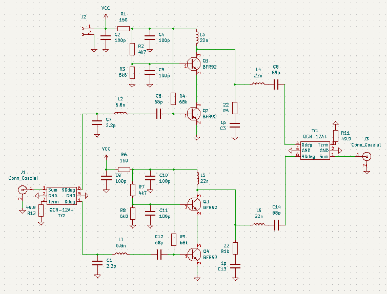

S-parameters:

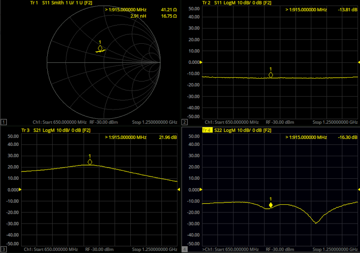

Power sweep, Pin = -35 dBm - -8 dBm

Gain: +21.9 dB, P1dBin: -9.1 dBm, OP1dB: +11.8 dBm

Current consumption is 20mA (Vcc = +9V)

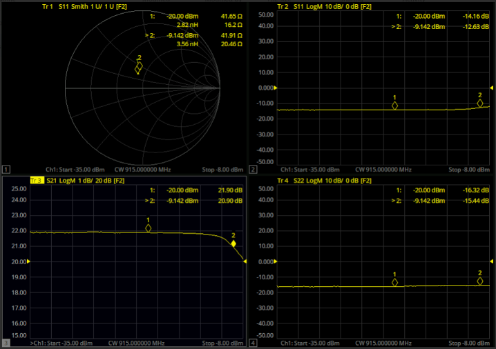

