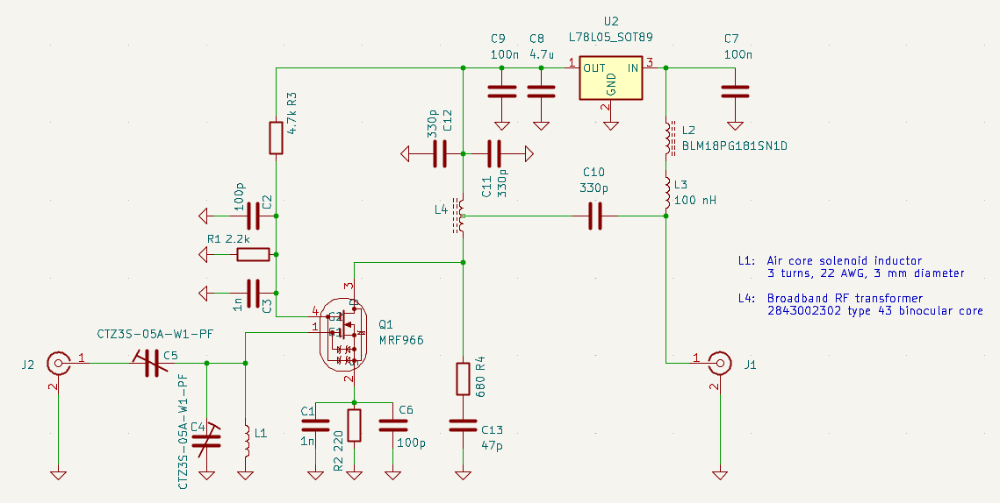
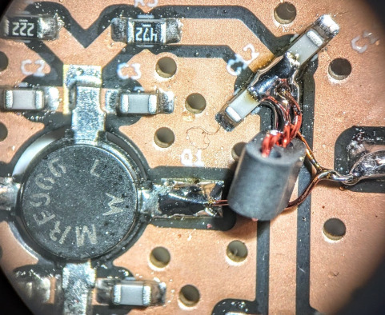
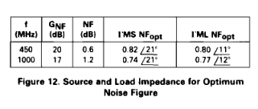
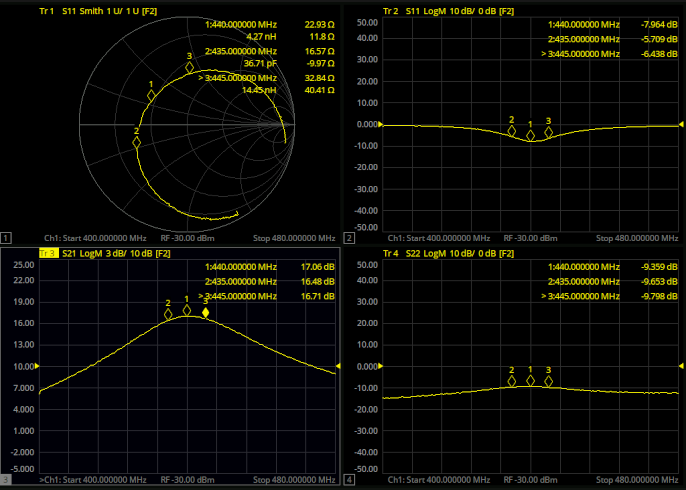

## GaAs MESFET low-noise antenna amplifier for 440 MHz

The amplifier is designed to be installed right at the antenna, its main purpose is to compensate for the loss of a long antenna cable and provide low receiver noise figure. DC power is supplied through the coax cable.

The amplifying device is a Motorola MRF966 dual-gate MES-FET, capable of NF=0.6 dB at 450 MHz.

#### Description

The input is tuned with a high-Q LC filter, matching is provided by a series trimmer capacitor (C5). The two degrees of freedom (C5 and C4) enables optimum NF vs. reflection coefficient adjustment.

The output is implemented with a hand-wound broadband transmission line RF transformer, creating a 200Ω -> 50Ω transition. A 680Ω resistor (R4) degenerates any resonance peaks at the output, ensuring stability. 

#### Input matching strategy (best noise figure vs. lowest reflection coefficient)

FETs are voltage controlled devices with infinite input impedance at low fequencies, so naturally they perform the best (highest amplification and lowest noise contribution) when they're driven by a high voltage + low current (= high impedance) source.

The datasheet calls for an optimum source impedance at 450 MHz that corresponds to 115.9 + j207.9 Ω. This source impedance is quite high and would create a serious mismatch at the antenna input, so an L-match (C5, and an imaginary inductance that's absorbed into the L1 C4 tank) transforms the antenna impedance up to the desired optimum. The combination of C4 and C5 allows a wide range of input impedance to be set, including a perfect match. The exact impedance at the gate of the transistor however is still unknown (mainly due to the lack of proper simulation data of this particular vintage device).

Since I don't have a noise meter, nor know the exact capacitance of the trimmers at each setting, I chose the strategy of trimming for the lowest input impedance while maintaining a somewhat acceptable reflection coefficient. This method ensures the highest impedance at the gate (for good noise figure), and also has the benefit of a resulting in a somewhat broader bandwidth, due to the gate impedance of the transistor (and also the Q of the inductor and trimmer cap) now affecting the overall Q of the LC tank.

Gain is +17 dB at 440 MHz, OP1dB = +3.3 dBm, DC current is 15 mA (supply voltage range: 7V - 35V).

