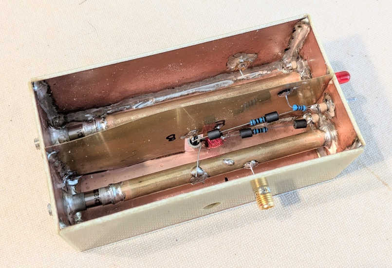
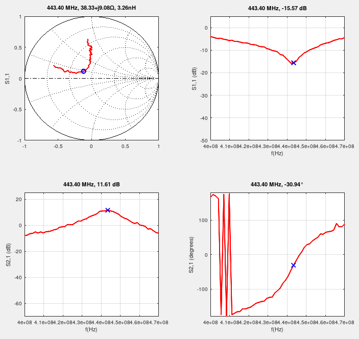
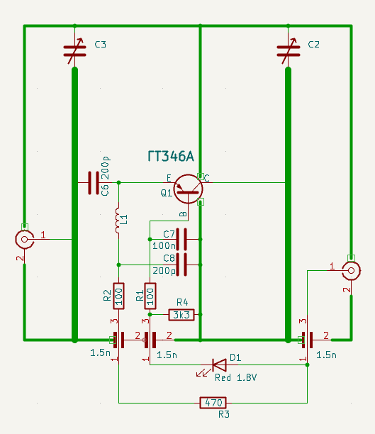
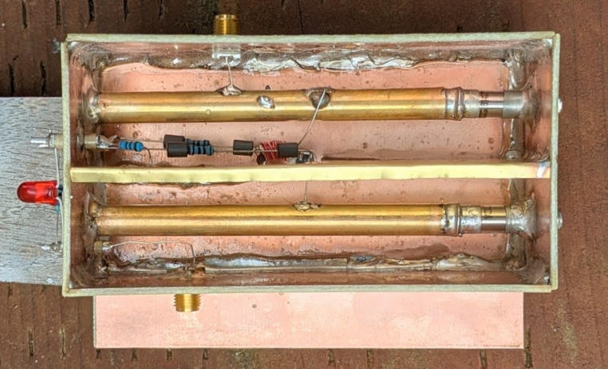

## Retro-style LNA for 440 MHz

The ГТ346A germanium PNP RF mesa transistor (Soviet equivalent of the Siemens AF239) was specificly developed for use in UHF TV tuners.

LNA of this style would be used as the first stage in 1960's European-style solid-state UHF TV tuners, and with its ~10 dB of gain it can decimate the noise contribution of a successive mixer stage (NF of early discrete mixers could be as high as 14 dB), while of course adding its own noise. According to the datasheet, at 800 MHz (which is the top of the UHF band) the NF of this transistor is 7 dB at most, gradually improving towards the lower end of the band to as low as 4 dB at around 400 MHz.

Germanium has an inherent speed advantage over silicon due to its higher charge carrier mobility, which made germanium the preferred choice for building RF transistors until more advanced silicon processes and devices (e.g. dual-gate MOSFET) eventually arrived.

S-parameters, measured (with my [DIY VNA](https://github.com/szoftveres/RF_instruments/tree/main/vna)) at -30 dBm power level:

The LNA is powered through its output coax cable, the LED (D1) acts as a constant voltage source at the base of the transistor and helps stabilizing the operating point over a broad range of supply voltage (4V - 12V). L1 quarter-wave line choke provides DC path to the emitter, while presenting high RF impedance to it. It is made of λ/4 (17.5 cm @ 440 MHz) length of copper wire, formed into a compact coil by winding it up around a small drill bit.

DC collector current is 2 mA (lowest noise figure setting, as per the datasheet).

The tunable λ/4 resonators are 4" long 1/4" diameter brass tubes inside 1" wide cavities, placed in the center and 1/2" from the bottom. Their characteristic impedance is ~ 90Ω, which at this length (4") can be made resonant at 440 MHz by adding 4-5 pF capacitance to the open end.

