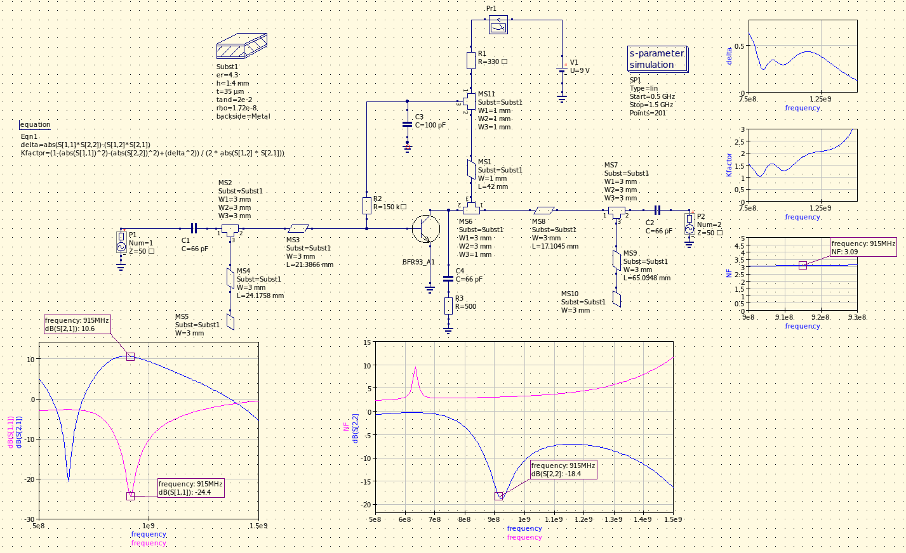
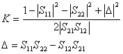
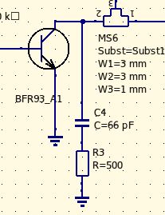
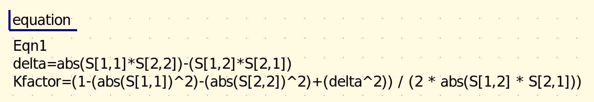

## Single BJT LNA for 915MHz with simultaneous conjugate stub matching

This is a bilateral case, meaning that any change in the matching conditions on one port affects the other one, due to the transistor internal (Miller) capacitance. Therefore matching has to be carried out simultaneously on both ports. (Cascode circuits largely overcome this problem by superior isolation between the ports)

The transistor is biased to ~4.5mA (minimum noise figure, according to the datasheet) and the ports are matched with single parallel open stubs. Gain is on the order of ~10dB with good (but narrow-band) input match at 915MHz (ISM mid-band).

Biasing of the collector is implemented by using a 1/4 wave (RF) shorted transmission line, which (as opposed to using an inductor) has the extra benefit of suppressing 2nd order harmonics, due to presenting an RF short at 2f at the collector of the transistor.

### Stability analysis

This amplifier is potentially unstable when its ports are matched, but can be made unconditionally stable by some degeneration of gain, and/or isolation of reactive load from its terminals. This can be achieved by i.e. a series or parallel resistor on its input or output. Attaching the resistor to the output is preferred however, due to the resistor having a contribution to the noise figure.

One approach is a parallel resistor (R3, 500 ohms, Q degeneration) attached to the collector, at the expense of ~1dB gain loss. Since the resistive component is added after amplification, its contribution to the overall noise figure is negligible.

Stability plots after adding the resistor:

### The build:

The LNA was built on [FR4 with copper tapes](https://github.com/szoftveres/RF_Microwave/tree/main/Microstrip) - the stability ensuring resistor was omitted since the LNA seemed oscillation free, even after tuning.

### Results after tuning:

Measured:

Simulated:

