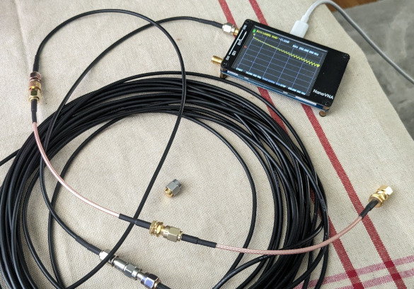
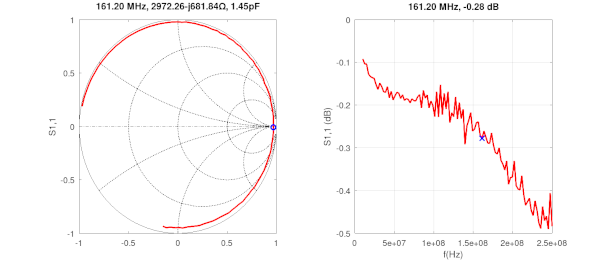
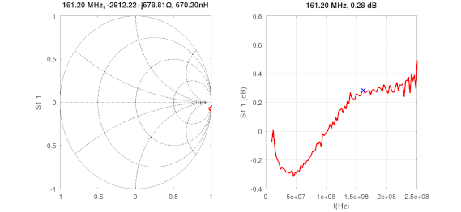
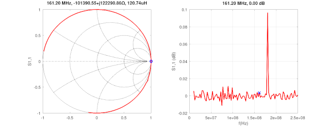

## 1-port calibration using the 3-term error model

[Calculating](calibration.m) the actual S-parameters of a DUT network, by the virtue of deemedding an "error matrix" from it (e.g. test fixture or cabling). The error matrix elements are obtained by measuring three different calibration standards and calculating the error coefficients. The actual maths are [here](https://github.com/szoftveres/RF_Microwave/tree/main/RFlib/p1cal.m).

The calibration allows arbitrary cal standard models, this has several advantages:
 * The standard open- short and load models can be parametrized (e.g. to include parasitics, and delay for port extension)
 * The open cal standard can be replaced by a known offset short, which is desired for waveguide measurements, since open waveguide standard is not available.

The fixture in this setup includes a 50ft long coax cable and a 1dB attenuator on port 1. All Touchstone (s2p) files (including DUT and Cal standard measurements) were collected without any previous calibration applied on the VNA.

### Raw measurements

Open (raw):

Short (raw):

Load (raw):

### After correction

Open (calibrated):

Short (calibrated):

Load (calibrated):

### Replacing the open cal standard with offset short

An offset short is made of a transmission line of known length, terminated by a short. This network provides an open at the calibration plane at a *single frequency* where the transmission line has a length of 1/4 wave. However, since the (arbitrary) calibration standards can be provided as parameters, we can build a frequency dependent model, modeling the behaviour of our known offset short as a function of frequency, and provide this model at each frequency point, accounting for the real behaviour of the offset short. This way we can fairly accurately provide a short as well as nearby references to our calibration.

The attached offset short has a 1/4 wave length at 161.2MHz

Measured offset short (corrected for by using the previous open cal standard):

Measured actual open, using the offset short as cal standard in place of an open:

Measured offset short, after using itself as a cal standard:

