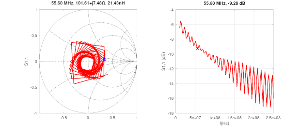
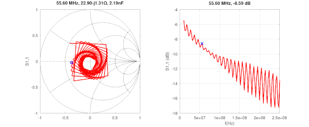
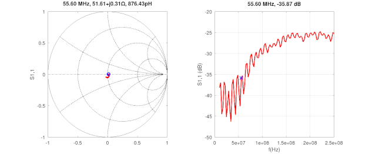
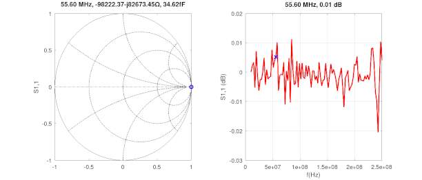
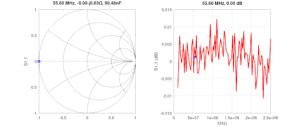
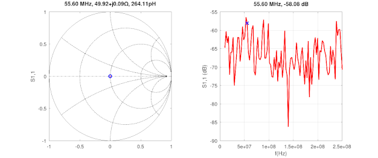

## 1-Port Calibration Using the 3-Term Error Model

[Calculating](calibration.m) the actual S-parameters of a DUT network, by the virtue of deemedding an "error matrix" from it (e.g. test fixture or cabling). The error matrix elements are obtained by measuring an open, short and load standards and calculating the error coefficients. The actual maths are [here](https://github.com/szoftveres/RF_Microwave/tree/main/RFlib/p1cal.m).

The setup includes a 50ft long coax cable and a 1dB attenuator on port 1. All Touchstone (s2p) files (including DUT and Cal standard measurements) were collected without any calibration applied on the VNA.

### Raw measurements

Open (raw):

Short (raw):

Load (raw):

### Calculated error matrix calibration applied

Open (calibrated):

Short (calibrated):

Load (calibrated):

