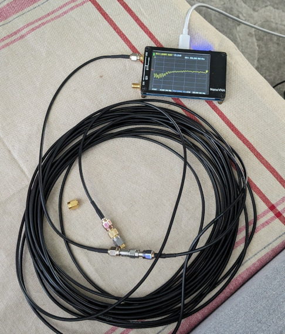

## 1-Port Calibration Using the 3-Term Error Model

[Calculating](calibration.m) the actual S-parameters of a DUT network, by the virtue of deemedding an "error matrix" from it (e.g. test fixture or cabling). The error matrix elements are obtained by measuring three different calibration standards and calculating the error coefficients. The actual maths are [here](https://github.com/szoftveres/RF_Microwave/tree/main/RFlib/p1cal.m).

The calibration allows arbitrary calibration standard models, this has several advantages:
 * The standard open- short and load models can be parametrized (e.g. to include parasitics, and delay for port extension)
 * The open cal standard can be replaced by a known offset short, which is desired for waveguide measurements.

The setup includes a 50ft long coax cable and a 1dB attenuator on port 1. All Touchstone (s2p) files (including DUT and Cal standard measurements) were collected without any previous calibration applied on the VNA.

### Raw measurements

Open (raw):

Short (raw):

Load (raw):

### Calculated error matrix calibration applied

Open (calibrated):

Short (calibrated):

Load (calibrated):

### Using offset short in place of an open

An offset short is made of a transmission line of known length, terminated by a short. There's no open standard in the rectangular waveguide world, hence the offset short provides the open reference at 1/4 wavelength, and the model provides further (frequency dependent) points.

The attached offset short has a 1/4 wave length at 161.2MHz

Measured offset short (calibrated using an actual open standard):

Measured actual open, using the offset short as cal standard in place of an open:

Measured offset short, after using itself as a cal standard:

