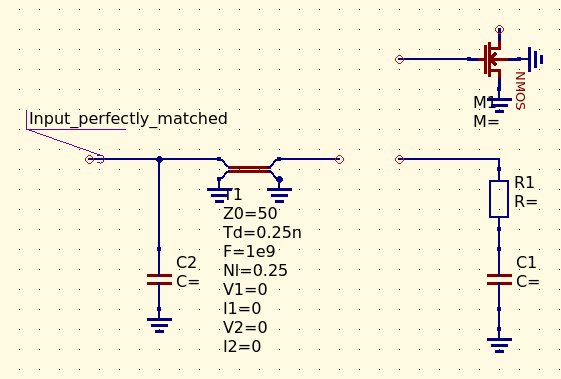

# Complex impedance matching with 1/4 wave impedance transformer

This [script](complexmatching.py) does multiple things:
* For a given complex impedance (given in a conventional, * *series* * *a + jb* form) it calculates the equivalent *parallel* components.
* It calculates the characteristic impedance of a 1/4 wave impedance transformer, that would convert the complex impedance in such a way, so that the equivalent *parallel* impedance would have a real part of 50 ohms. The benefit of this is that the remaining reactance can easily be resonated out with its complex conjugate reactance, resulting in purely ohmic 50 ohm impedance.

The 1/4 wave impedance transformer transforms the *magnitude* of the complex impedance, along with converting any reactance to its complex conjugate. This way, e.g. a complex impedance with a capacitive component can be transformed to look like inductive, which then can be easily resonated out by adding capacitance.

An example:
A MOSFET or BJT is typically seen as capacitive, with some resistive component. Knowing the complex input impedance, this script can calculate the matching network (1/4 wave impedance transformer and capacitance) to perfectly match the input of these devices to 50 ohms.

