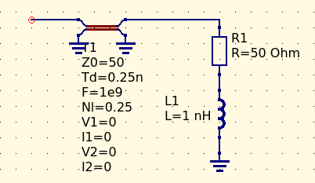

# One-port fixture de-embedding

First, we need to reconstruct the ABCD matrix of the entire system. Since we only have a single-port impedance but want to build a 2-port network, we pretend that the other port is there but has nothing attached to it. Also, -for the sake of simplified de-embedding maths- we pretend that the network we've measured is on port 2, and hence the network we're working with is the mirrored, i.e. the inner network is followed by the fixture, which then connects to the outside world (port 2).
As a first step, we establish S22, from the measured impedance (Z22). Then we build up our ABCD matrix of the *entire system* (pretending that any S-parameter involving port 1 is zero).
As a next step, we build up the ABCD matrix of the *fixture* - which in this case is modeled ideal transmission line.
Finally, we de-embed the fixture from the system by the virtue of a simple matrix division - which is possible due to the fact that we used the *"mirrored"* image of the network (pretending that the ABCD matrix of the fixture was cascaded with the inner network, resulting in the measured impedance by the VNA) 

This little script takes a complex impedance, and deembeds a given transmission line (characterized by its characteristic impedance and the phase angle) from it. Useful for determining the impedance of a network behind a known transmssion line.

