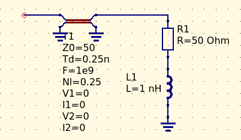
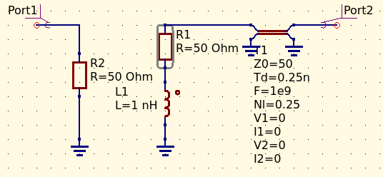
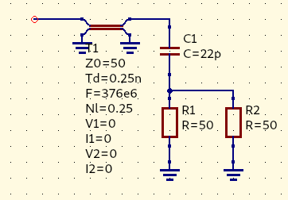
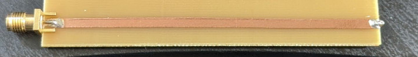
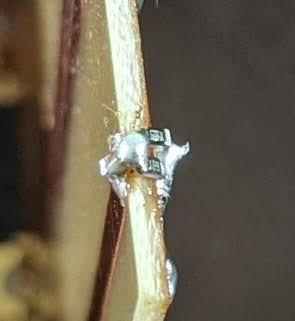
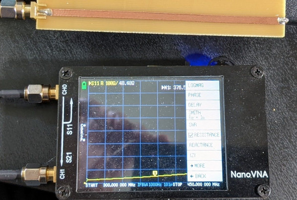
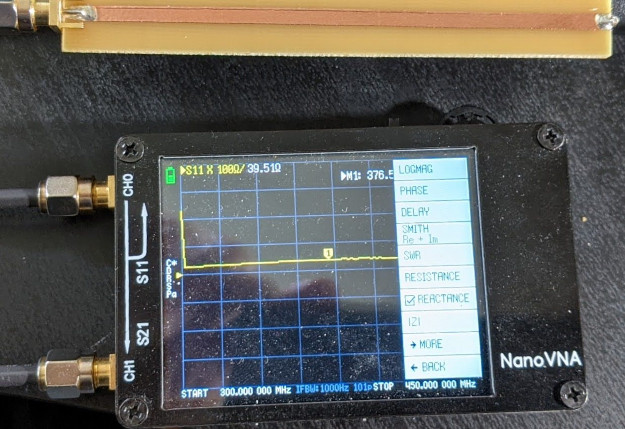

# One-port fixture de-embedding

This [little script](deembed.m) takes a complex impedance, and de-embeds a given fixture (e.g. a transmission line, characterized by its characteristic impedance and the phase angle) from it. Useful for determining the impedance of a network behind a known fixture.

First, we need to reconstruct the ABCD matrix of the entire system. Since we only have a single-port measurement but want to build the ABCD matrix of a 2-port network, we pretend that the other port is there, but it's terminated and the two ports don't interact. Also, -for the sake of simplified de-embedding maths- we assume that the network we're working with is on port 2 (mirrored).

As a first step, we establish S22 from the measured impedance (Z22). Then we build up our ABCD matrix of the *entire system* with S22, assuming that all the other S-parameters (the ones involving port 1) are zero.

As a next step, we build up the ABCD matrix of the *fixture* - which in this case is a modeled ideal transmission line.

Finally, we de-embed the fixture from the system by the virtue of a simple matrix division - which is possible due to the fact that we used the *"mirrored"* image of the network, i.e. we assumed that the ABCD matrix of the fixture was cascaded together with the inner network, resulting in the impedance we've measured with the VNA.

### 2x-thru de-embedding

In case the 2x-thru s-parameters are available (which is the case when a special coupon board is constructed for 2-port network measurement, containing both the embedded circuit as well as the symmetrical, thru-cunnected in- and out fixtures), the network parameters of the individual fixtures can easily be calculated by first converting the 2x-thru line s-parameters (obtained by a simple VNA measurement) to ABCD matrix, then simply applying a matrix square root operation (by definition, the 2x thru network is the product of the cascaded ABCD matrices of the two individual fixtures). Matrix square root operation is readily available in Matlab and Octave; the prerequisite though is that the two fixtures have to be fully symmetrical, and as homogenous as possible.

## Example

We have a series RC network of 25ohms and 22pf behind a [50ohm copper tape microstrip line that has a length of 1/4 wave at 376MHz](https://github.com/szoftveres/RF_Microwave/tree/main/Microstrip)

When we measure this network, we get a Z1,1 impedance of *48.4 + 39.5j* ohms.

After de-embedding the 1/4 wave transmission line (since this time we don't have the second SMA connector, and the components are directly soldered to the other end of the miscrostrip line, I deducted ~10% from the overall transmission line electrical length), we get an impedance of *26.675 - 17.813j* ohms, which is an impedance of a series RC network of 26.7 ohms resistance and 23.7pf capacitance at 376MHz.

