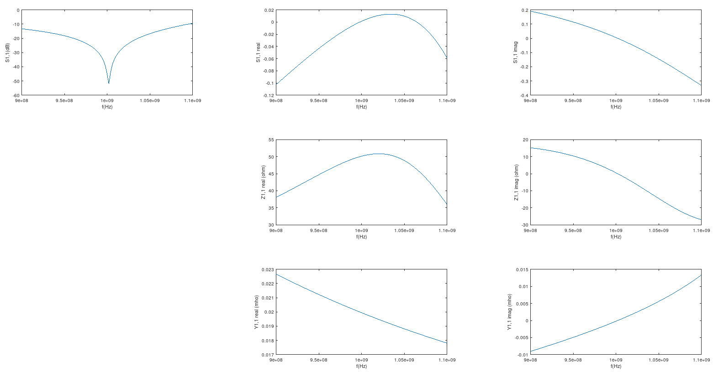

# Various examples

## Single stub matching

The distance of the stub from the load impedance is chosen so that Y1,1 is 1/50ohms (0.02S) at f (1GHz); then, the remaining reactance is resonated out by the stub, giving good match at f.

