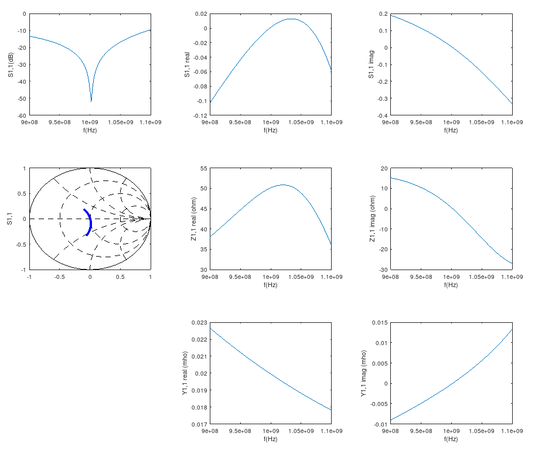
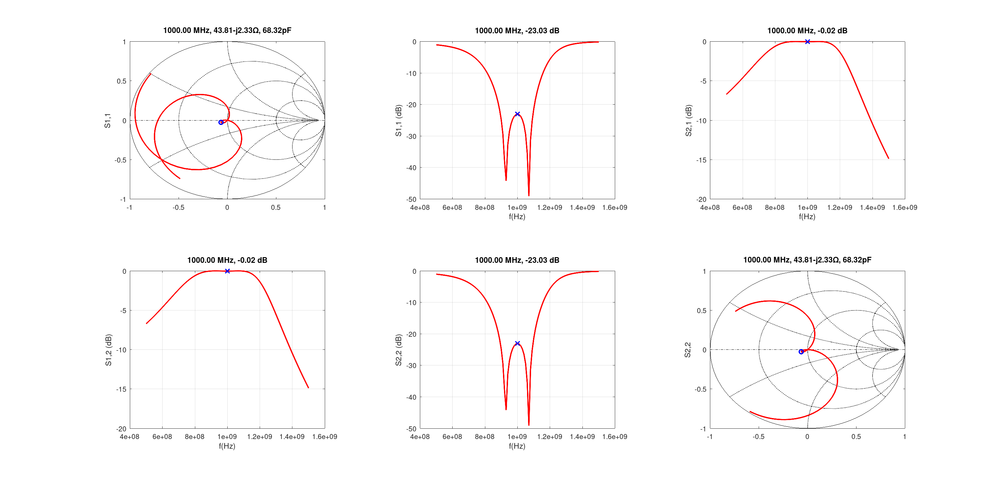

# Various examples

## [Single stub matching](singlestubmatch.m)

The distance of the stub from the load impedance is chosen so that Y1,1 is 1/50ohms (0.02S) at f (1GHz); then, the remaining reactance is resonated out by the stub, giving good match at f.

## [Broadband matching with cascaded L-match networks](broadbandlcmatch.m)

Cascading two L-matches together, assuming intermediate imaginary impedance of sqrt(Zs * Zl), and also applying frequency correction for centering the peaks around the desired center frequency.

