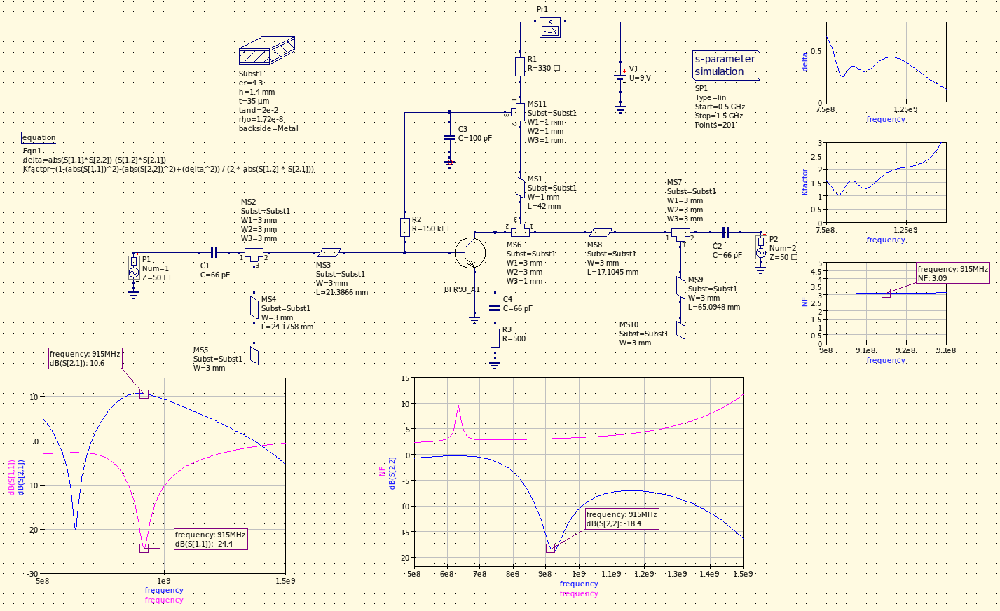
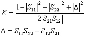
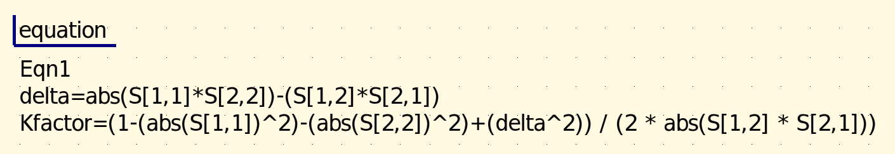
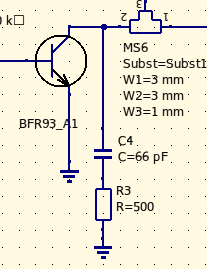
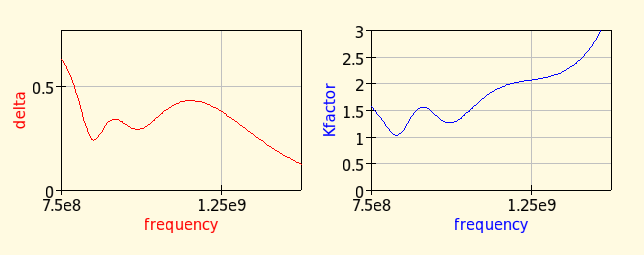

# LNA design

## Narrow-band LNA design for 915MHz, using BFR91A BJT transistor and stub-matching.

### The design:

This is a bilateral case, meaning that any change in the matching conditions on one port of the transistor affects the other one, due to the internal feedback capacitance. Therefore matching has to be carried out simultaneously on both ports.

The transistor is biased to ~4.5mA (minimum noise figure, according to the datasheet) and the ports are matched with single parallel open stubs. Gain is on the order of ~10dB with good (but narrow-band) input match at 915MHz (ISM mid-band).

Biasing of the collector is implemented by using a 1/4 wave (RF) shorted transmission line, which (as opposed to using an inductor) has the extra benefit of suppressing 2nd order harmonics, due to presenting an RF short at 2f at the collector of the transistor.

### Stability analysis

The amplifier becomes unconditionally stable after adding a resistor (R3, 500 ohms, Q degeneration) to the collector, at the expense of ~1dB gain loss. Since the resistive component is added after amplification, its contribution to the overall noise figure is negligible.

Stability plots after adding the resistor:

### The build:

### Results after tuning:

Simulated:

Measured:

