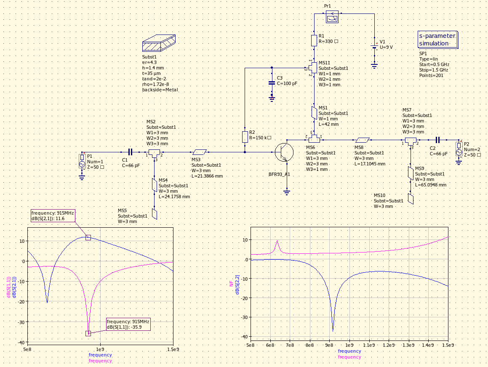
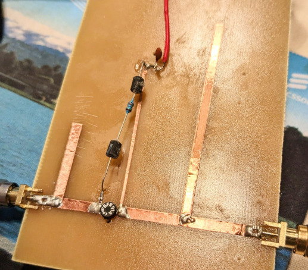
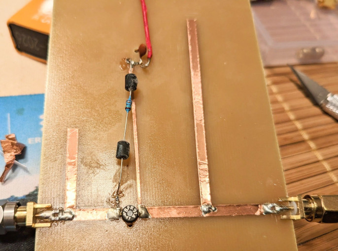
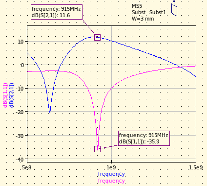
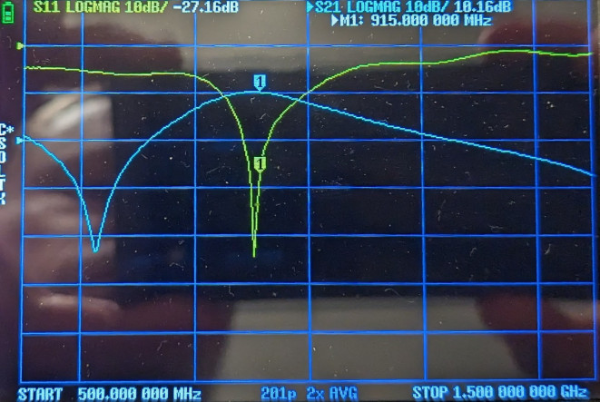

# LNA design

## Narrow-band LNA design for 915MHz, using BFR91A BJT transistor and stub-matching.

### The design:

This is a bilateral case, meaning that any change in the matching conditions on one port of the transistor affects the other one, due to the internal feedback capacitance. Therefore matching has to be carried out simultaneously on both ports.

The transistor is biased to ~4.5mA (minimum noise figure, according to the datasheet) and the ports are matched with single parallel open stubs. Gain is on the order of ~10dB with good (but narrow-band) input match at 915MHz (ISM mid-band).

### The build:

### Results after tuning:

Simulated:

Measured:

