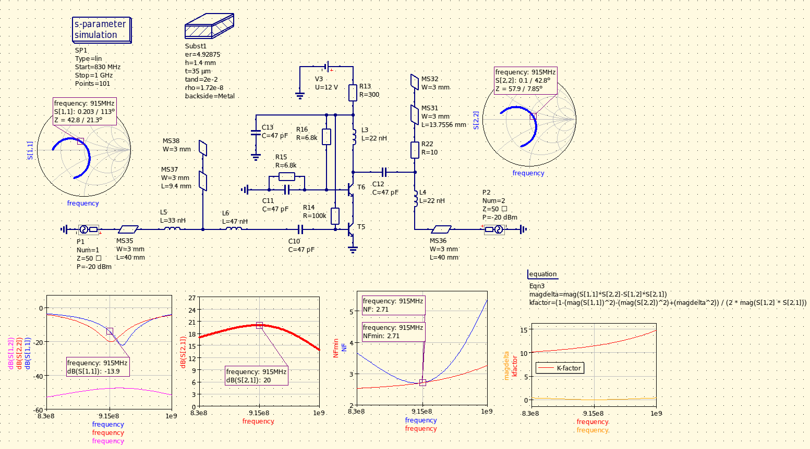
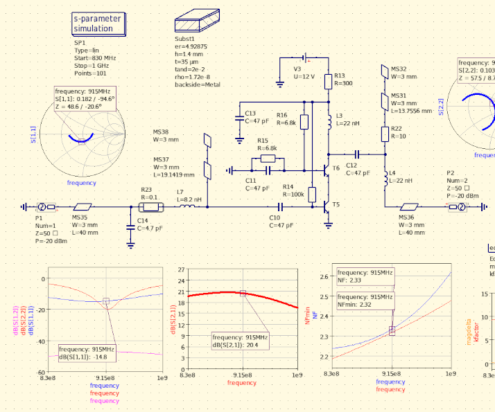
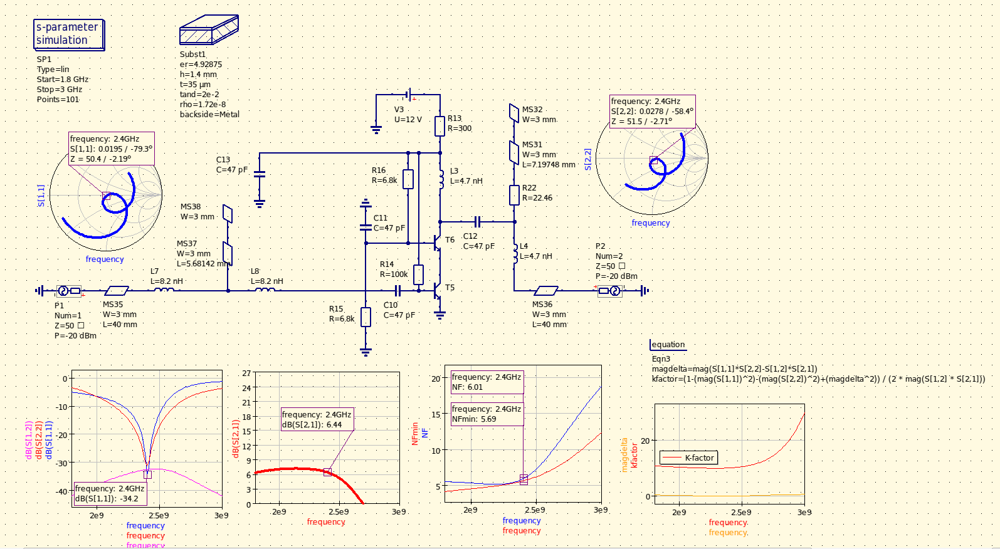
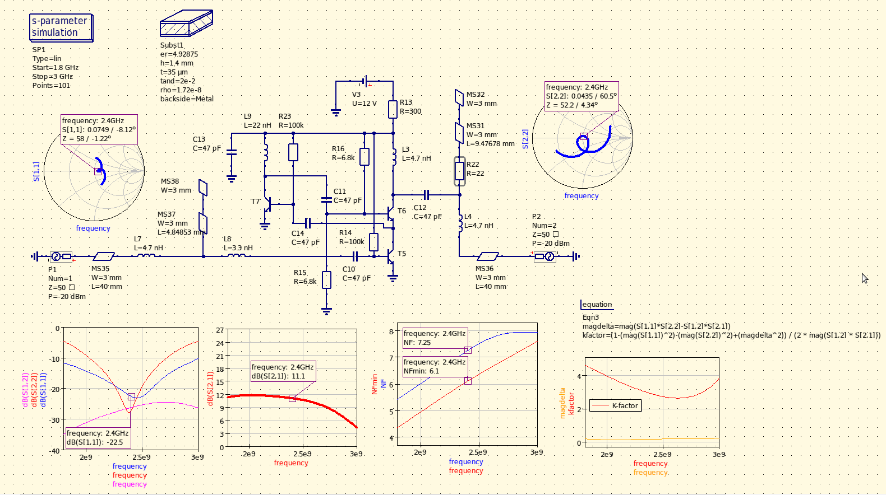

## The 915MHz design

Cascode architecture has several benefits over a single transistor; tuning the matching on either side becomes a much easier task due to improved isolation of the two ports. Stability improves significantly and also more gain is achievable due to higher output impedance.

The design is optimized around inductor values that are available to purchase as discrete parts; the matching networks use electrically short microstrip lines as trimmable shunt capacitors.

Input matching is implemented with a high-Q narrow-band T-match, which has a natural filtering and band-passing effect before the first LNA stage. Output matching is implemented with an L-match; the added artificial resistive loss (R22, 10ohm) in series with the shunt capacitance (electrically short microstrip) has beneficial effects on stability (degenerating the Q of the matching network, at the expense of gain) without having significant effects on the noise figure.

With the transistors used in this circuit (Philips/NXP BFR92A, ft = 5GHz) stability is not an issue at these frequencies.

### Noise sources

Besides non-ideal (lossy) inductors in the input T-matching network, the use of electrically short microstrip stub in place of a shunt capacitor has a slight degradatory effect on the noise figure (around 0.6dB, vs. an ideal 1.5pF capacitor) due to being built on lossy PCB material and being at the highest impedance point of the matching network.

NF can be improved by around 0.4dB without compromising tunability, by implementing a PI-match and moving the tunable microstrip stub to the lowest impedance point of the LNA (base of the BJT), at the expense of lower inductor and capacitor values (more uncertainty when using discrete parts) as well as the need for a good ground via for the discrete shunt capacitor.

With input PI-match:
  

The bias point for best NF of this transistor is at around 5mA, running the device at higher currents (e.g. for better P1DB) will start degrading the best obtainable NF. 
Also, the input matching is a tradeoff between best match vs. best obtainable NF.

## Adopting for 2.4GHz

The BJTs used in this circuit begin showing their limitations at higher frequencies, in the form of reduced gain and increased noise figure

The gain near the ft of the transistors can theoretically be improved by boosted (regulated) cascode topology:

