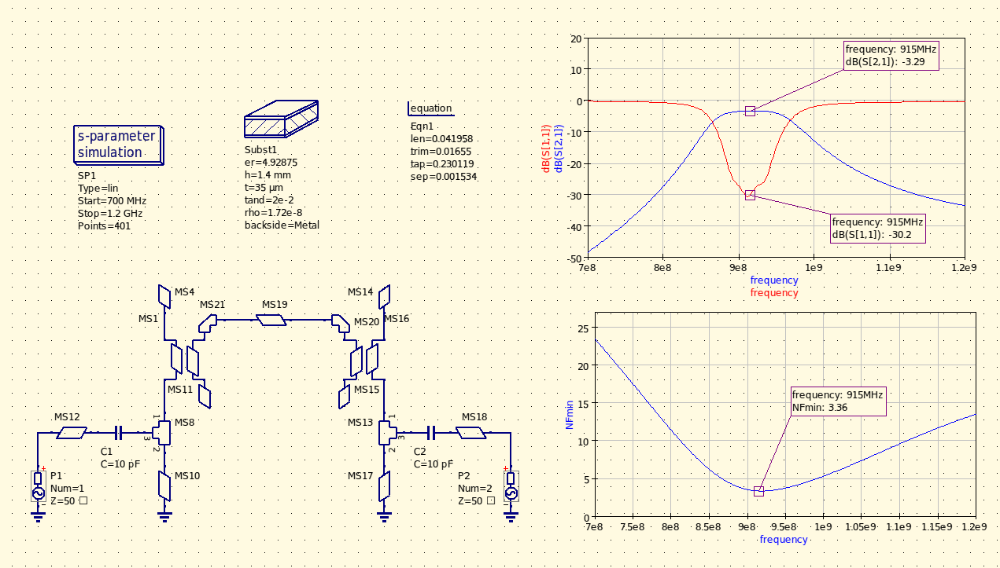
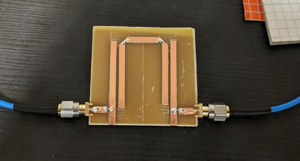
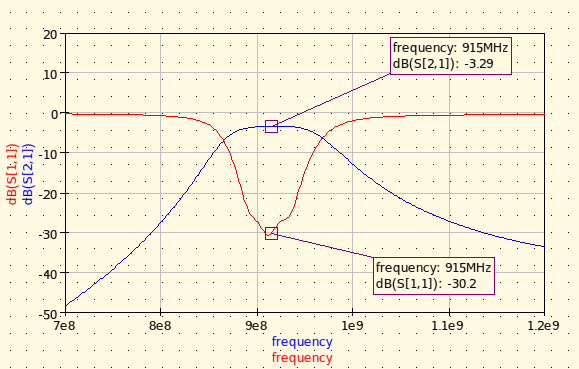
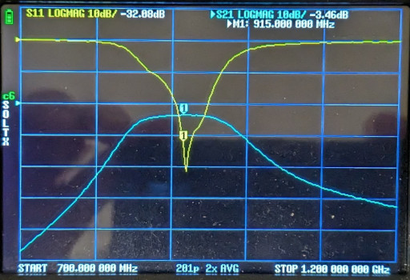
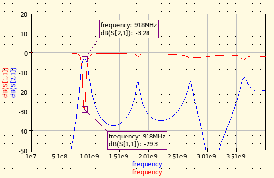
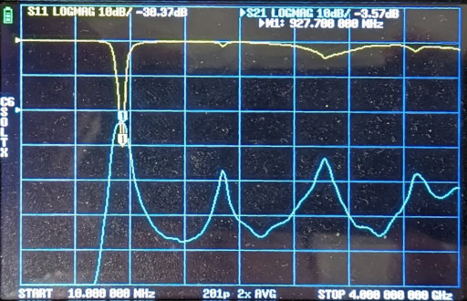

# Microstrip Filters

## 915 MHz Hairpin Filter

Microstrip filter optimized for the ISM band (902MHz - 928MHz).

Lossy PCB material and therefore high NFmin inherently makes this architecture unsuitable for pre-LNA application, however otherwise it's quite useful where the signal levels are high enough.

Due to the stub nature of the filter, resonances appear at every 3rd odd harminics, however the appropriate placement of the input- and output ports along the length of the shorted stubs ensure that the ports are only matched at the fundamental frequency and therefore the odd harmonics are adequately suppressed by the virtue of mismatch at the ports.

Narrow-band performance

Wide-band performance (simulated and measured)

