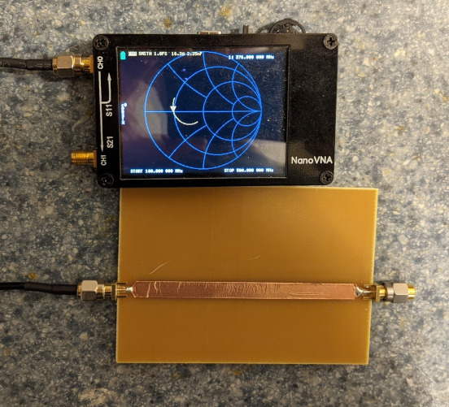

# Building a 50ohm copper-tape microstrip on a single-sided PCB of unknown dielectric substrate

First we need to determine the Er of the substrate. We have a 1/4" wide copper tape and a 1.4mm thick single-sided PCB with a ~35um thick copper layer on it to work with:

After building a transmission line with this copper strip of known width on the PCB of known thickness, we need to determine its characteristic impedance; we can use the 1/4 wave impedance transformer method for this: a 1/4 wave impedance transformer terminated by 50ohm on one side looks purely resistive on its other side at the frequency where it's behaving as a 1/4 wave impedance transformer, and the impedance it's showing (measured by VNA) is based on how it's reflecting the 50ohm termination back, based on its own characteristic impedance.
The characteristic impedance of the transmission line can then be derived from the impedances at its two sides: Zt = sqrt(Z1 * Z2), where Z1 is the termination impedance (50ohm) and Z2 is the measured impedance (16ohm) at its other side.

The resulting characteristic impedance of the transmission line is 28.28ohms, which checks out, as the trace is quite wide and impedace gets lower with more capacitance (Z = sqrt(L/C)).

Next, we can use an online microstrip calculator tool to come up with an Er for the substrate, knowing that building a 1/4" wide trace on a 1.4mm thick piece of it results in a 28.28ohm transmission line:

The resulting Er is around 4.3, which also checks out; it's a common number for FR4 substrates.
We can use the same tool to come up with a width for the final, 50ohm transmission line:

The resulting width is 2.72mm.

We can verify the new, 2.72mm wide transmission line, by again using the 1/4 wave impedance transformer method. The new, 50 ohm terminated 1/4 wave impedance transformer is showing impedances between 44ohm and 50ohm, corresponding to 47-50ohm transmission line characteristic impedance.

## Coupled-line bandpass filter

Microstrip band-pass filter centered around 961MHz, built on a PCB with copper-tape.

S1,1 (yellow) and S2,1

