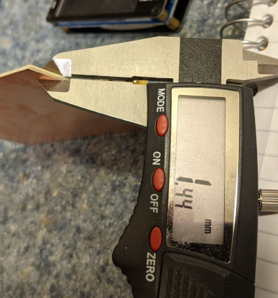

# Building a 50ohm microstrip line

First we need to determine the Er of the PCB. We have a 1/4" copper tape and a 1.4mm thick PCB:

Next, we need to measure the impedance of the transmission line; we can do this with the 1/4 wave transformer method: the 50ohm terminated transmission line looks purely resistive at the frequency where it's behaving as a 1/4 wave transformer, and the impedance it's showing at the VNA port is based on how it's reflecting the 50ohm termination, based on its own characteristic impedance.
The characteristic impedance of the transmission line can then be derived from the impedances at its two sides: Zt = sqrt(Z1 * Z2)

