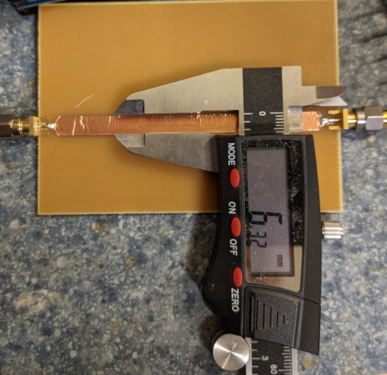
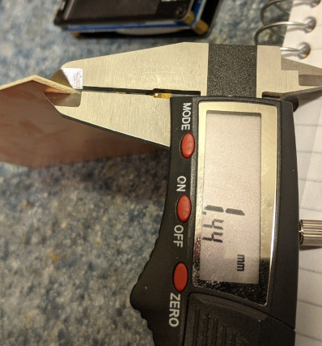
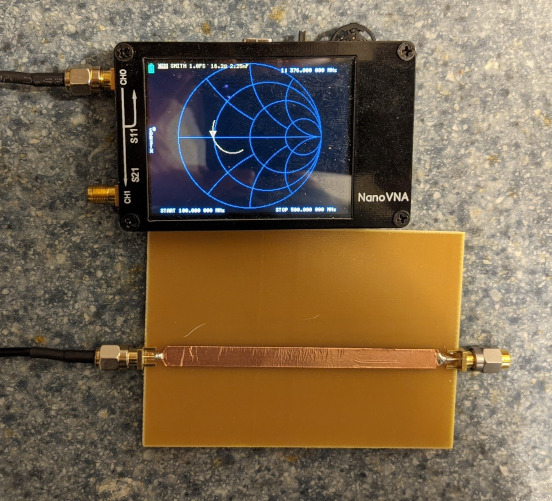
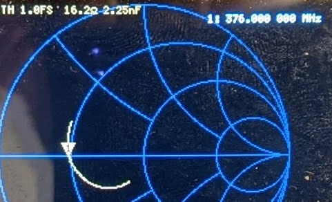
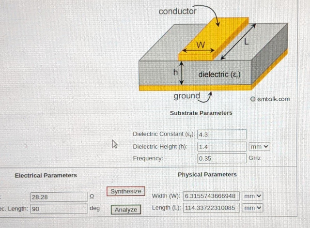
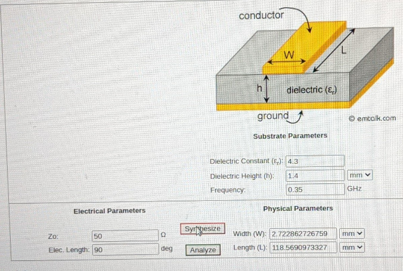
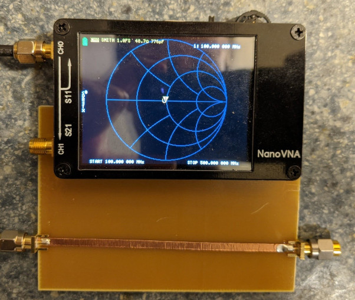

# Determining the Er parameter of an unknown substrate and building a 50Ω copper-tape microstrip on it

We have a 1.4mm thick single-sided PCB of unknown substrate and a 1/4" wide copper tape at hand to work with:

After building a transmission line with this copper strip of known width on the PCB of known thickness, we need to determine its characteristic impedance; we can use the λ/4 impedance transformer method for this: a λ/4 impedance transformer terminated by 50Ω on one side looks purely resistive on its other side at the frequency where it's behaving as a λ/4 impedance transformer, and the impedance it's showing (measured by VNA) is based on how it's reflecting the 50Ω termination back, based on its own characteristic impedance.
The characteristic impedance of the transmission line can then be derived from the impedances at its two sides: Zt = sqrt(Z1 * Z2), where Z1 is the termination impedance (50Ω) and Z2 is the measured impedance (16Ω) at its other side.

The resulting characteristic impedance of the transmission line is 28.28Ω, which checks out, as the trace is quite wide and impedace gets lower with more capacitance (Z = sqrt(L/C)).

Next, we can use an online microstrip calculator tool to come up with an Er for the substrate, knowing that building a 1/4" wide trace on a 1.4mm thick piece of it results in a 28.28Ω transmission line:

The resulting Er is around 4.3, which also checks out; it's a common number for FR4 substrates.
We can use the same tool to come up with a width for the final, 50Ω transmission line:

The resulting width is 2.72mm.

We can verify the new, 2.72mm wide transmission line, by again using the λ/4 impedance transformer method. The new, 50Ω terminated λ/4 impedance transformer is showing impedances between 44Ω and 50Ω, corresponding to 47Ω-50Ω transmission line characteristic impedance.

