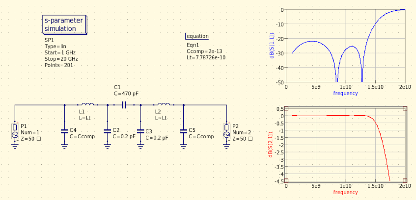

## SMD pad discontinuity compensation

SMD pads (e.g. footprint of inline DC blocking SMD capacitors) present a shunt capacitive discontinuity in the transmission line which can significantly affect high-frequency behaviour.

This can be compensated by absorbing this parasitic capacitance into a lumped-element transmission line segment (Pi-network), which can be easily realized using microstrip technology.

The high-frequency bandwidth limit of the lumped-model transmission line is the natural lumped LC resonance frequency of the network.

