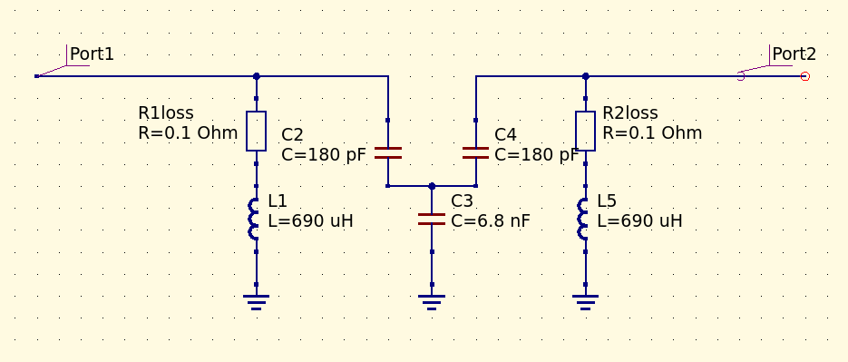
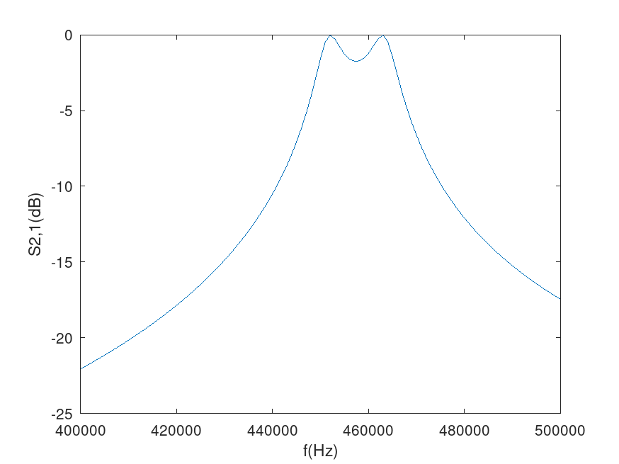
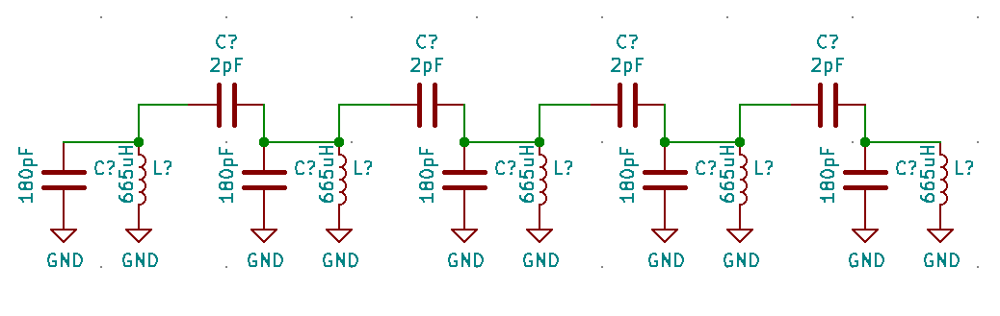
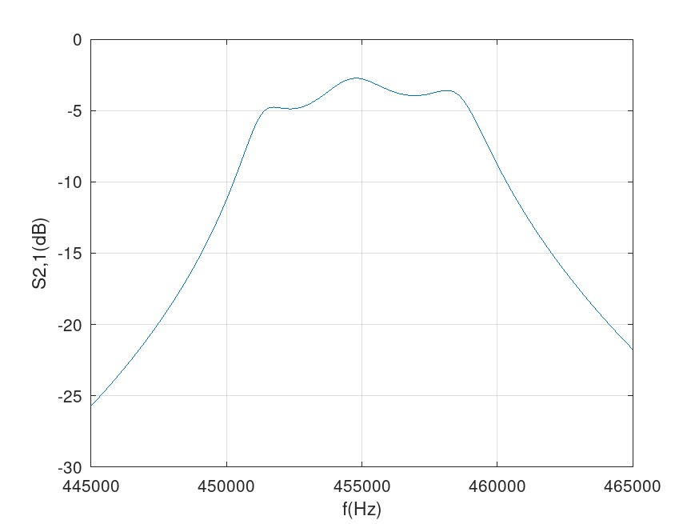

# Transfer matrix simulation of two loosely coupled resonant tank circuits

[Simulation code](bandpass2element455kHz.m)

GNU Octave (MATLAB-alike) simulation of two, loosely coupled LC tank circuits (fc around 455kHz), using the cascaded transfer (ABCD) matrix technique.

```
        L1              C2              C3              C4              L5
      parallel        series         parallel         series         parallel
      inductor       capacitor       capacitor       capacitor       inductor

M = | 1     0 |  x  | 1 Z(c2) |  x  | 1     0 |  x  | 1 Z(c4) |  x  | 1     0 |
    | Y(l1) 1 |     | 0     1 |     | Y(c3) 1 |     | 0     1 |     | Y(l5) 1 |
```






# 5 element bandpass filter centered at 455kHz

[Simulation code](bandpass5element455kHz.m)

Transfer (ABCD) matrix modeling and simulation with realistic inductor losses and port impedances






