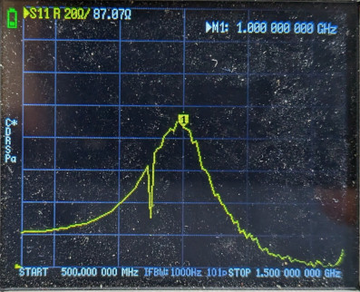
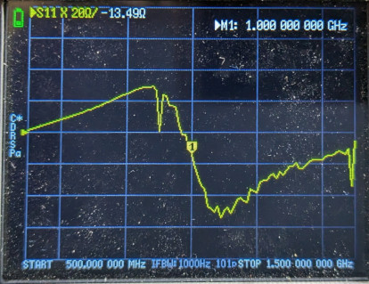
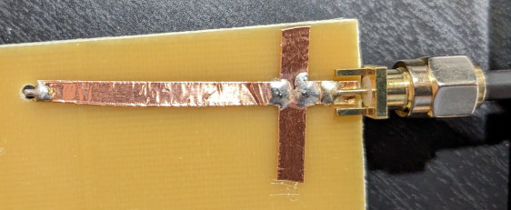
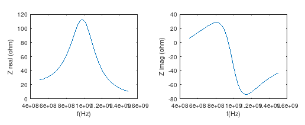

# Output Matching Network

Simulation of a loaded transmission line impedance transformer, tuned to 1GHz.

The capacitively loaded 1/4 transmission line (due to change in boundary conditions) becomes resonant at a lower frequency - this can be advantageous, e.g. to create a narrow band impedance matching circuit, using the transmission line as the inductor.

The unequal ratio of the loading capacitances ensures that the load (50 ohm) gets transformed to a higher impedance, e.g. to match the high impedance of the output of a transistor amplifier.

In the below example, a transmission line with a characteristic impedance of 100 ohms and a length equal to the 1/4 wavelength of 1.5GHz is loaded with 1.5pF at the amplifier output (Hi-Z) side and with 5pF at the 50 ohm load (Lo-Z) side.

Measurement with real (lossy) components show degraded Q and lower input impedance

Re-simulated with lossy T-line and caps with ESR

