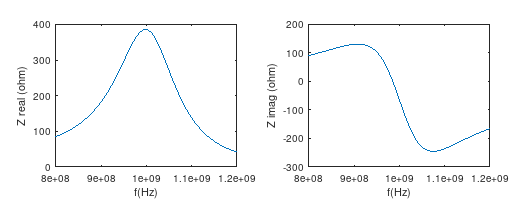

# Output Matching Network

Simulation of a loaded transmission line impedance transformer, peaked at 1GHz.

The capacitively loaded 1/4 transmission line (due to change in boundary conditions) becomes resonant at a lower frequency - this can be advantageous, e.g. to create a narrow band impedance matching circuit, using the transmission line as the inductor.

The unequal ratio of the loading capacitances ensures that the load (50 ohm) gets transformed to a higher impedance, e.g. to match the high impedance of the output of a transistor amplifier.

