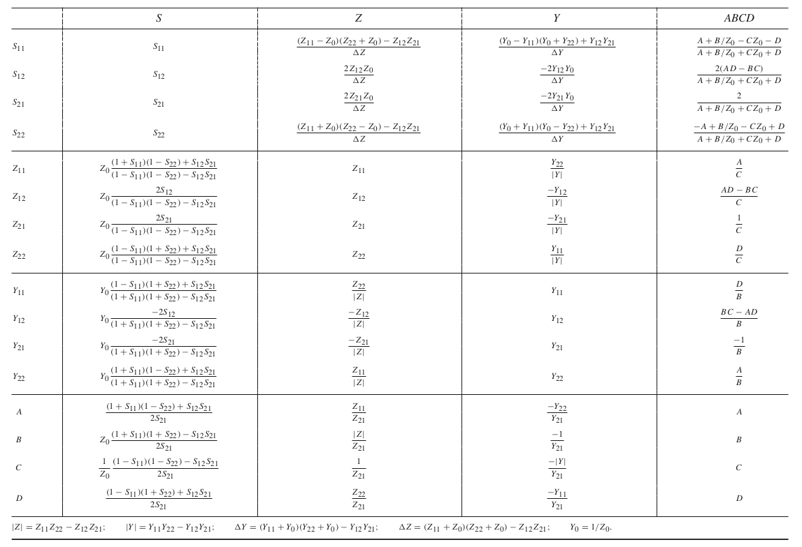

This repository contains a full 2-port GNU Octave RF network simulation framework, as well as some RF projects.

## Microstrip

* [Coupled line filter](https://github.com/szoftveres/RF_Microwave/tree/main/Microstrip/Filters)
* [Hybrid Coupler](https://github.com/szoftveres/RF_Microwave/tree/main/Microstrip/Hybrid)
* [SMD pad discontinuity compensation](https://github.com/szoftveres/RF_Microwave/tree/main/Microstrip/pad_comp)
* [Determining the properties of an unknown substrate](https://github.com/szoftveres/RF_Microwave/tree/main/Microstrip/Substrate)

## Amplifiers

* [Cascode BJT LNA](https://github.com/szoftveres/RF_microwave/tree/main/Amplifier/cascode)
* [Single BJT LNA](https://github.com/szoftveres/RF_microwave/tree/main/Amplifier/single_bjt)
* [Balanced Amplifier](https://github.com/szoftveres/RF_microwave/tree/main/Amplifier/balanced)

## EM / Antenna

* [915MHz Dipole with Gamma-match](https://github.com/szoftveres/RF_microwave/tree/main/em_antenna/dipole_915_gamma)
* [Waveguide to microstrip adapter](https://github.com/szoftveres/RF_microwave/tree/main/em_antenna/wg_adapter)

## RF/Microwave Simulations

* [2-port RF network simulation framework (cascaded ABCD matrix solver) for GNU Octave](https://github.com/szoftveres/RF_Microwave/tree/main/RFlib)
* [VNA calibration maths](https://github.com/szoftveres/RF_Microwave/tree/main/Cal)
* [Fixture de-embedding](https://github.com/szoftveres/RF_Microwave/tree/main/DeembedFixture)
* [Complex impedance matching with λ/4 impedance transformer](https://github.com/szoftveres/RF_Microwave/tree/main/ComplexMatching)
* [Time-domain reflection (TDR) simulation](https://github.com/szoftveres/RF_Microwave/tree/main/tdr)
* [Transfer (ABCD) matrix simulation of loosely coupled resonant tank band-pass filters](https://github.com/szoftveres/RF_Microwave/tree/main/MultiElementBandpassFilter)
* [QAM with channel (white) noise and phase noise](https://github.com/szoftveres/RF_Microwave/tree/main/signal/qam)

