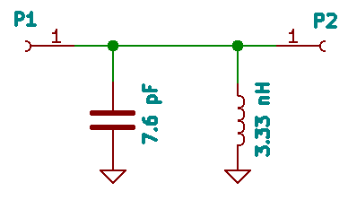
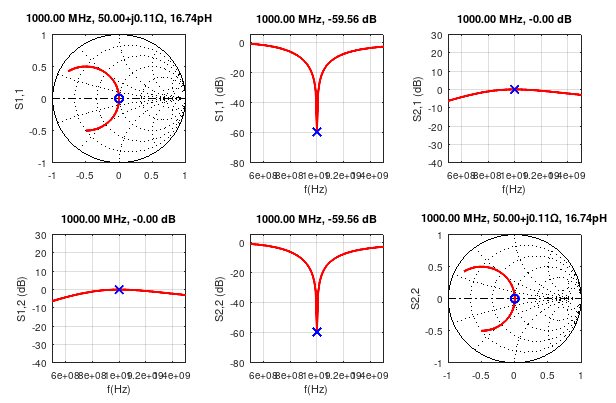
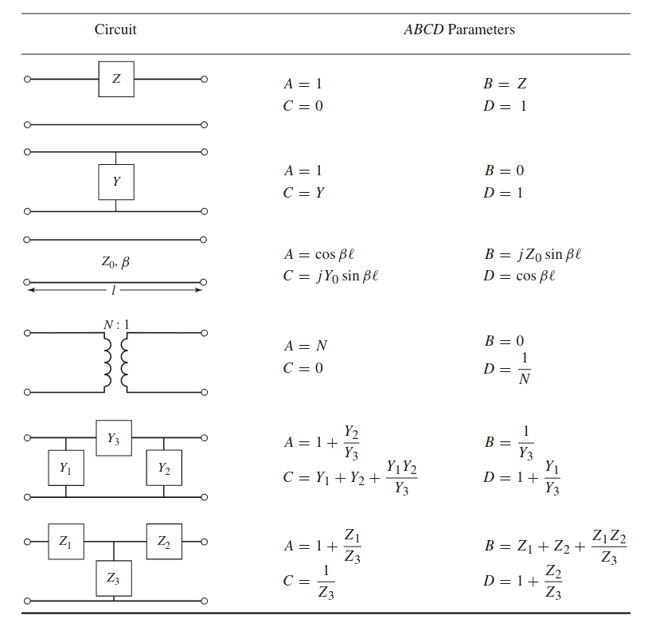
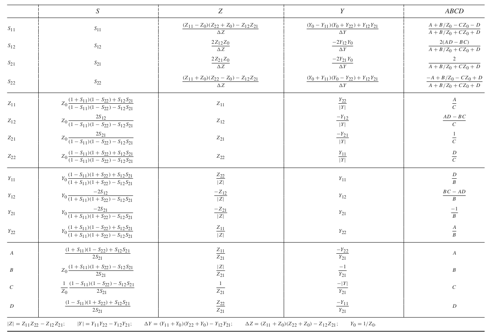

# Two-port RF network frequency-domain solver toolkit

## Example

#### Simple resonant LC tank 

Schematic diagram:



Simulation code:

```
% Path to the framework functions
addpath("../RFlib")

% port impedance
Z0 = 50;

% frequency points
sweeppoints = 500e+6:10e+6:1.5e+9;

% LC tank parameters
L = 3.33e-9;
C = 7.6e-12;

% S-parameter array
ts = sweep2ts(sweeppoints);

% Main loop
for fp = 1:length(sweeppoints)
    f = sweeppoints(fp);

    % Cascaded transfer (ABCD) matrix
    M =     ShuntImpedanceMatrix( InductorImpedance(L, f) );
    M = M * ShuntImpedanceMatrix( CapacitorImpedance(C, f) );

    % Converting to S-parameters and saving to the array
    ts.points(fp).S = abcd2s(M, Z0);
end

% Plotting the result
plot2ports(ts, 51);
```

Result:







