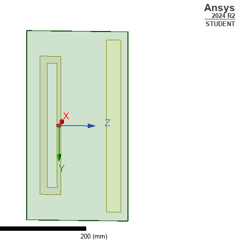
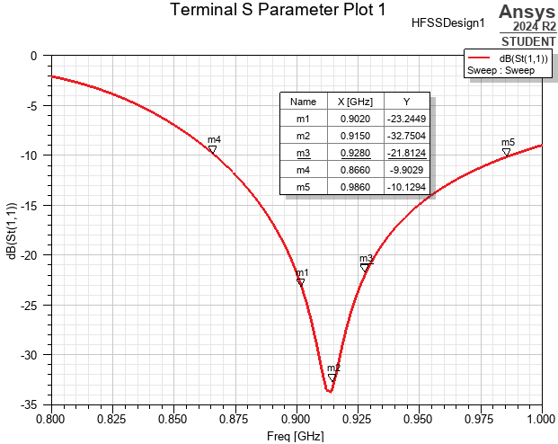
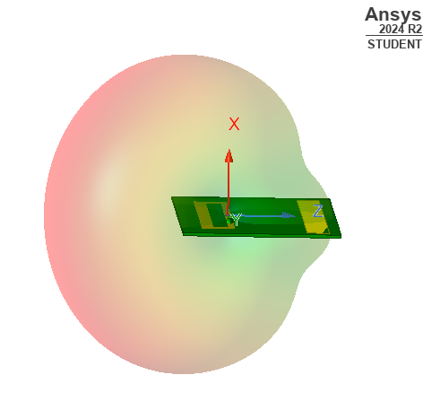
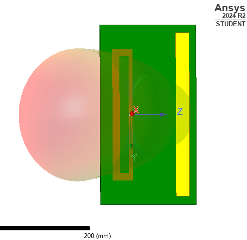
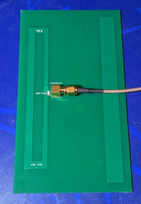
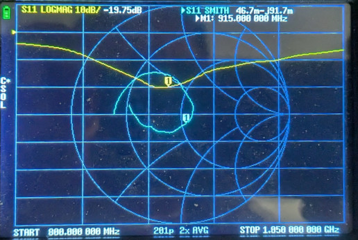

# 915 MHz two-element Yagi-Uda antenna

This antenna was designed to be made of PCB material and meant to be direcitonal.

The expected feedpoint impedance of the active element (folded dipole) is around 4 x 73 Ω (conveniently 300 Ω) if its longitudinal parts are of the same width and there are no passive elements nearby. However the proximity of the passive reflector element drastically brings down the feedpoint impedance quite a bit to the point where matching to 50 Ω and simultaneously converting the feedpoint to single-ended feed using a commercial balun becomes a challenge, as well as it de-tunes the antenna. Luckily, increasing the thickness of the outer parallel trace (increasing the thickness ration of the two parallel lines) of the driven element increases the feedpoint impedance. Finding a suitable thickness that brings the feedpoint impedance to 200 Ω makes the differential to single ended conversion as well as matching to 50 Ω an easy task, using an off the shelf 4:1 balun (Mini-Circuits TCN4-162+).

The design process started with the definition of the rough dimensions of the driven element and the reflector (~25% longer than the driven element). As a next step, the distance between the two elements were adjusted for the best front-top-back ratio while simultaneously making adjustments to the lenght of the elements (tuning) for resonance. As the last step, the the thickness of the outer parallel trace of the driven element was increased in order to reach the desired feedpoint impedance. Further small incremental adjustments were made for further optimizing the performance.

Since the antenna is made of a regular (lossy) FR4 PCB substrate, loss could be an issue with higher frequencies, however two independent simulation software showed better than 98% efficiency for this design.

The build included the 4:1 balun as well as an SMA connector; resonance is a bit off but the input return loss semms quite acceptable.

