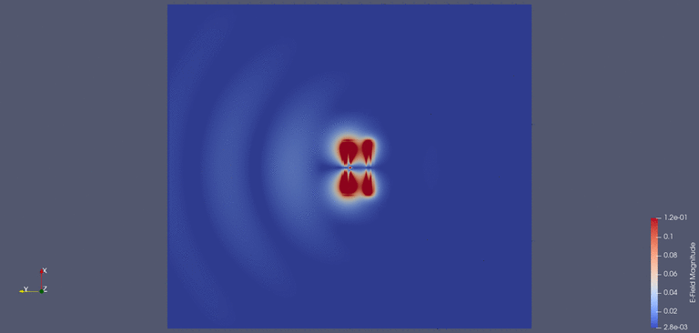

# Two-element Yagi-Uda PCB antenna for the 915MHz ISM band

### Design

The goal was to design a simple, cheap (PCB), high-performance antenna for DIY experiments.

Yagi-Uda antennas are probably the most popular types at this frequency and above due to easy implementation on PCB. Normally one reflector element and multiple director elements are used to achieve high directivity and gain, however with more directors, the antenna becomes bigger and more narrow-band. It's been known that adding a reflector to a dipole instantly buys approximately ~3dB gain, however subsequent gain increase requires multiple directors, e.g. another 3dB gain requires at least two more directors, which increases the size significantly, plus reduces the bandwidth of the antenna. Hence I decided to implement the antenna with just a single reflector, which seemed like a "best bang for the buck" solution.

The feedpoint impedance of a standard, resonant folded dipole with equal wide wires is around 4 x 73 Ω (conveniently 300 Ω). Adding a passive reflector element nearby interferes with the dipole and drastically brings down the feedpoint impedance as well as it de-tunes the antenna. The differential feedpoint impedance (after re-tuning) is now below 200 Ω, which is difficult to convert to single-ended 50 Ω. Luckily, increasing the thickness of the outer parallel wire (trace) of the dipole increases the feedpoint impedance; 200 Ω can be achieved by thickening the outer wire, which now can be converted to single ended 50 Ω with a 4:1 balun (Mini-Circuits TCN4-162+).

The design process started with the definition of the rough dimensions of the driven element and the reflector (~16% longer than the driven element). As a next step, the distance between the two elements were adjusted for the best front-top-back ratio while simultaneously adjustments were made to the lenght of the elements (tuning) for resonance. As the last step, the thickness of the outer parallel trace of the driven element was adjusted in order to reach the desired 200 Ω feedpoint impedance. Further small incremental adjustments were made consequtively, to further optimize the performance and parameters.

Since the antenna is made of a regular (lossy) FR4 PCB substrate, loss could be an issue with higher frequencies, however two independent simulation software showed better than 98% efficiency for this design.

Radiation pattern overlaid on the model; peak gain is on the order of 5.7dBi, front-to-back ratio is roughly 12dB.

OpenEMS simulation of E-field magnitude and element phasing:

### Build and measurements

The build included the 4:1 SMD balun (Mini-Circuits TCN4-162+) as well as an SMA connector.

VNA measurement largely agrees with the simulation, e.g. the return loss is better than -10dB between 850MHz and 950MHz, which conveniently gives ~100MHz bandwidth and very good match (S1,1 down to almost -20 dB) in the intended 915 MHz band.

