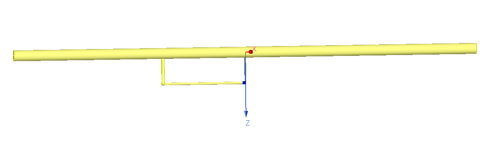
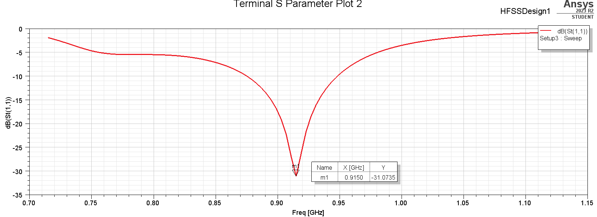
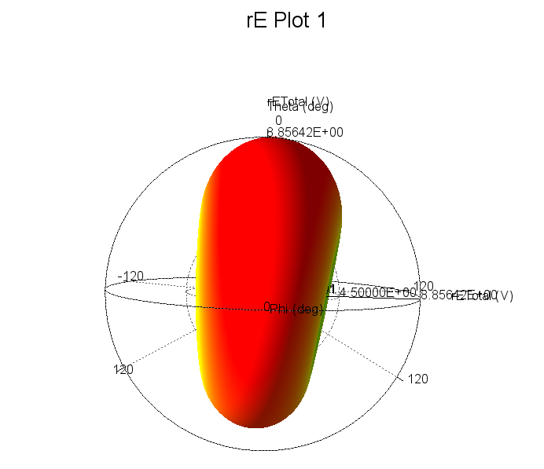
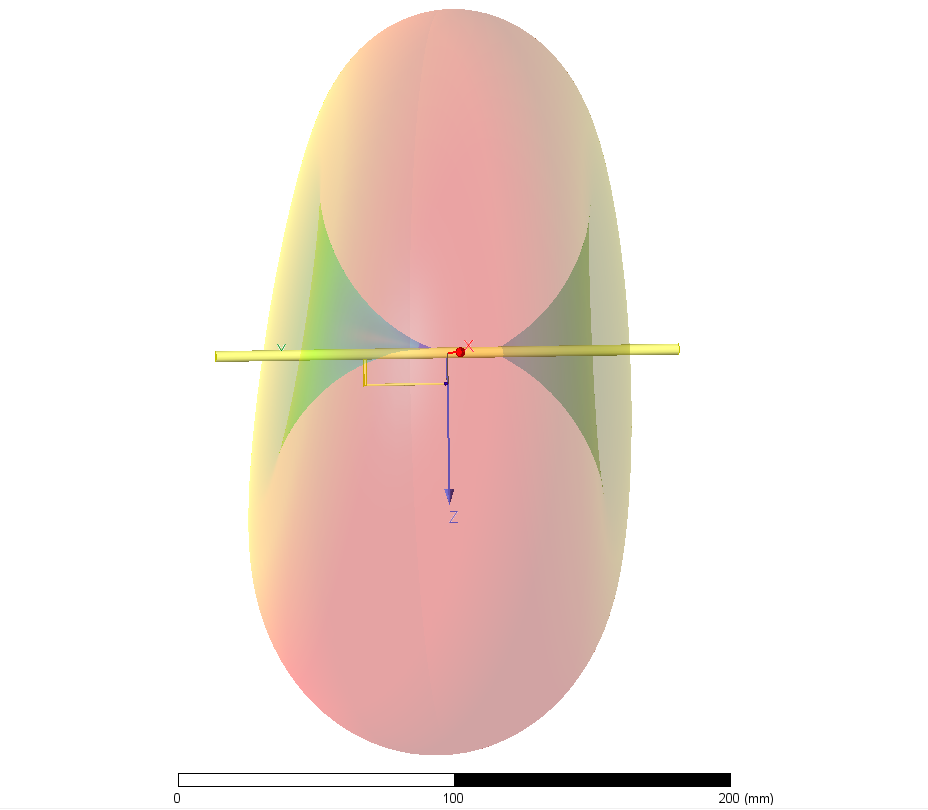
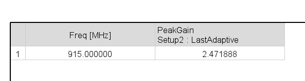

# 915 MHz Dipole with Gamma-match

Optimized and matched with HFSS

The radiation pattern is slightly asymmetrical due to the influence of the gamma match - this in turn increases the peak gain to approximately 2.47dBi

