# 5.8 GHz ISM band aperture-coupled microstrip patch antennas

Designed around OSHpark's 4-layer service.

The design starts with a regular microstrip patch, with its length selected to be resonant at the band center frequency. The width of the patch influences the gain as well as the apparent feedpoint impedance at a given coupling; the wider the patch, the more the directivity (gain), because the two in-phase ends of the spreading fringing fields along the long edge of the patch start behaving like an array instead of a point-source, focusing the beam, as well as due to simply the larger aperture. A wider patch also results in lower feedpoint impedance (for a given coupling) as well as slightly more bandwidth. If circular-polarization is not a requirement, selecting the width to be slightly different from the lenght is advantageous, because it reduces the risk of cross-polarization. The beamforming on the longitudinal axis is due the patch antenna being equivalent to essentially two in-phase aperture antennas (the aperture is formed between the edges and the ground plane). The end result is a relatively high gain antenna with well-defined directivity.

Coupling is done to the antenna from the feed line microstrip via an aperture on the ground plane, embedded inside the antenna PCB (aperture-coupling is described [here](https://ptacts.uspto.gov/ptacts/public-informations/petitions/1525304/download-documents?artifactId=d23MfW1fvKR4pzkGUmERh8ZxrJW7turGkfuFS_fFzEMN9wEr-BOYOZo) and [here](https://people.umass.edu/dpozar/miscfiles/aperture.pdf)). The size (length) of the aperture determines the coupling and consequently the feedpoint impedance. Due to this extra independent feedpoint impedance adjustability, there's some freedom with regard to selecting the width of the patch; A slightly wide (more focused beam, as well as to prevent cross-polarization) but mostly square design is a good starting point; in this case, the W:L ratio is 1.125.

The microstrip feed line crosses the aperature in the middle, and ends in a 1/4λ open stub, with its low-impedance point being right over the aperture (any extra unwanted reactances can be tuned out by slightly changing the length of the stub in either way, as necessary).

S11 of the simulated design (using OpenEMS FDTD FEM electromagnetic solver):

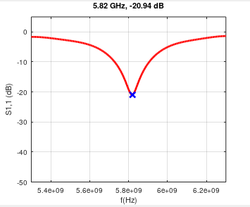

The result (as expected from a regular, simple patch antenna) is very narrow-band performance, barely sufficient to cover the ~ 200 MHz bandwidth of the 5.8 GHz ISM band.

An example was built and measured (with my [DIY VNA](https://github.com/szoftveres/RF_instruments/tree/main/vna)):

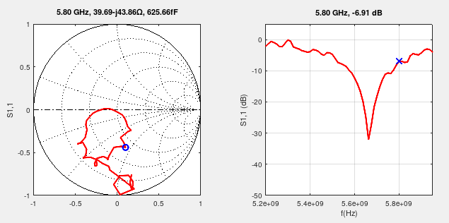

The result is narrow-band performance as well as complete uselessness due to a slight (~1.7%) center frequency difference between the simulated and actual manufactured antennas.

Tight-coupling a resonant element (with close or identical resonant frequency) to a patch antenna can broaden its bandwidth; in this case a suspended patch of identical dimensions was added to the existing antenna. After re-tuning and optimizing the coupling aperture (due to changing impedance conditions), an antenna with more broadband performance emerged:

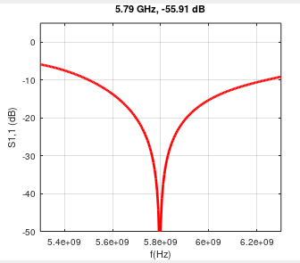

Since there are now two independent patch elements, each of them could operate in different modes (e.g. completely in- or out-of-phase), which could potentially intruduce unwanted sidelobes, so the behaviour of the electric fields as well as the radiation pattern needs to be watched closely.

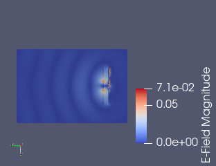

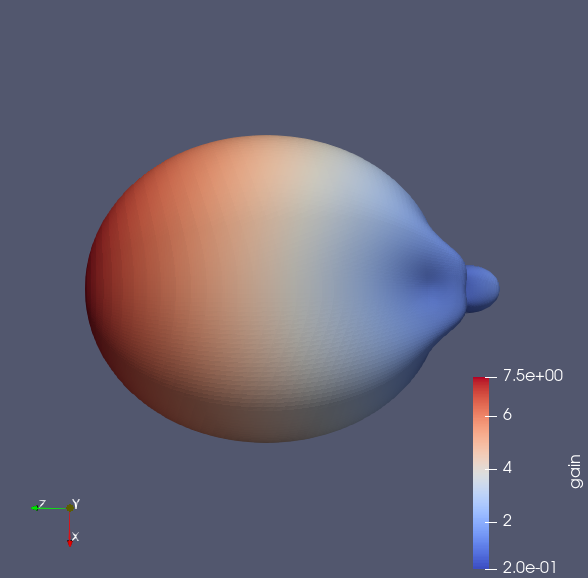 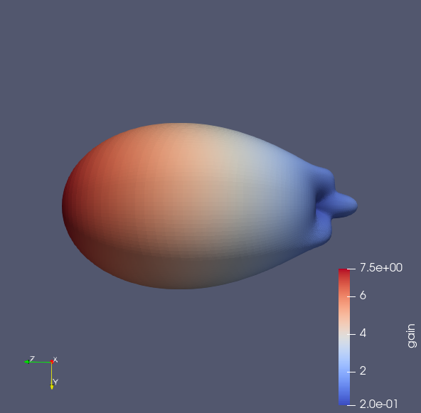

The OpenEMS FEM simulation shows a well behaving antenna so far with no issues.

The actual manufactured antenna is made of two pieces (the active and the passive parts), bolted together using M3 nylon bolts. The radiation pattern was measured in a simple room setup using two identical antennas, one as Tx and one as Rx (the wavelength at 5.8 GHz is short enough so that just a short distance between the two antennas satisfies far-field measurement requirements while being able to keep reflective materials at sufficient distance)

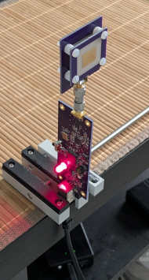

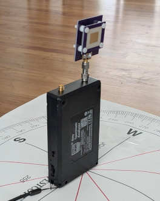

The transmitter is my [DIY 6 GHz signal generator](https://github.com/szoftveres/RF_instruments/tree/main/siggen), the receiver is a cheap TinySA Ultra. Results were plotted on a chart and reveal great similarity to the simulated results:

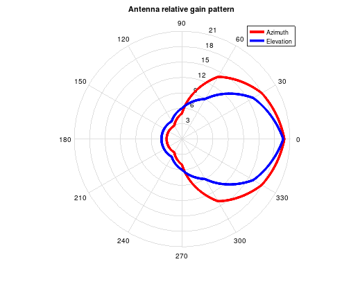

VNA measurement of the antenna also confirms the expected greater bandwidth:

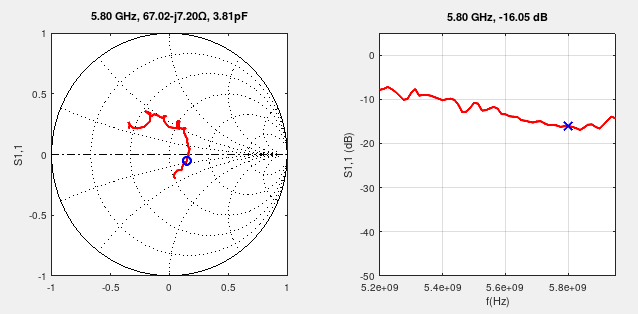

With slight modifications to the aperture size in the simulation I was able to get pretty much the exact same S11 reults as measured above with the VNA; This helps with aligning the simulation better with the actual manufactured PCB performance:

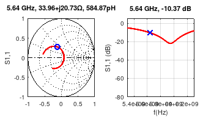

