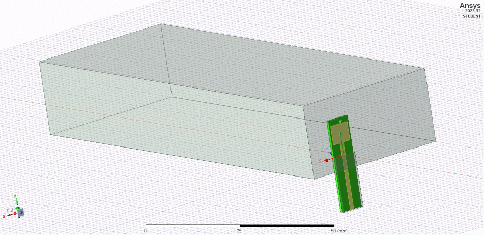
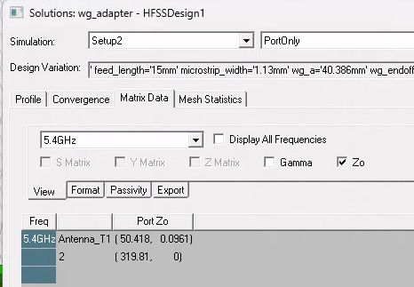
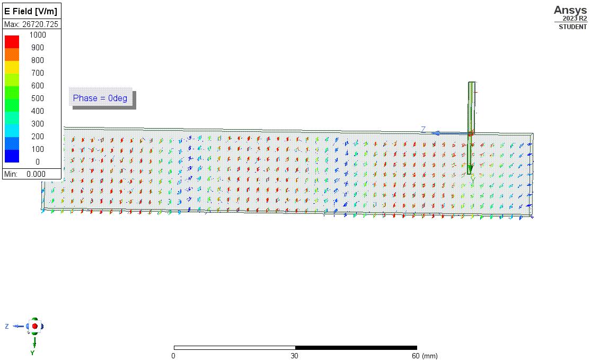
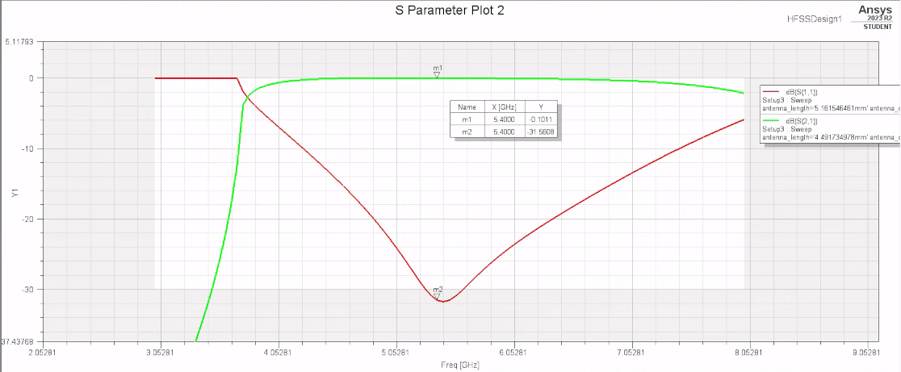

# Microstrip to waveguide adapter

Microstrip to WR159 waveguide adapter, simulated and optimized in HFSS, for 5GHz WiFi band

The design is constrained by the mid-band frequency and bandwidth, the waveguide dimensions and the microstrip line impedance (this latter can be verified by solving for ports only).

The probe ("antenna") is at a λ/4 distance from the back-short wall at mid-band.

