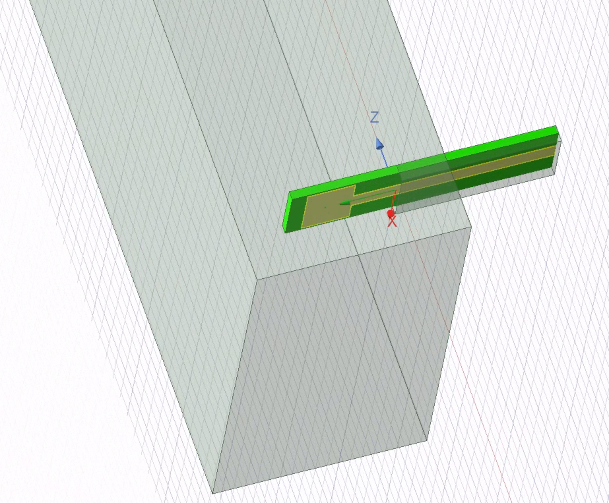
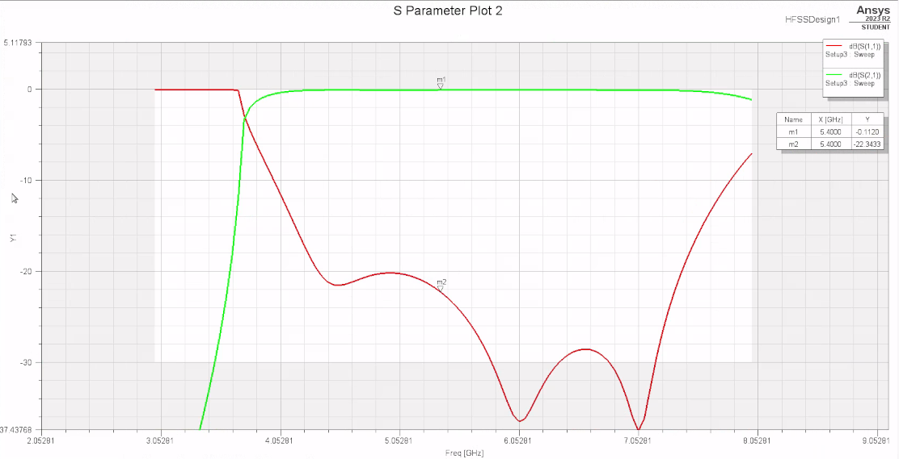

# Microstrip to waveguide adapter

Microstrip to WR159 waveguide adapter, simulated and optimized in HFSS, for 5GHz WiFi band

The probe ("antenna") is at a λ/4 distance from the back short wall at mid-band.

