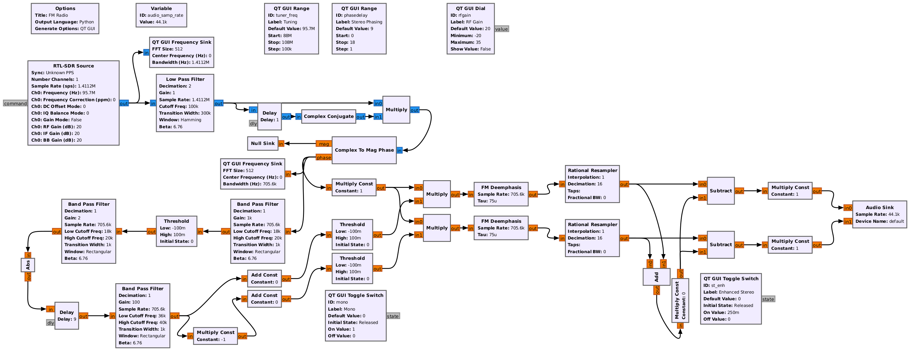

## FM Stereo RTL-SDR Receiver

Fully DIY implementation (i.e. not using any pre-defined GNU Radio blocks); Polar discriminator FM demodulator and pilot-frequency doubling Stereo MPX decoder, with post-processing stereo enhancer.

