## FMCW Radar

Prototyping and testing

### Architecture

The radar operates in the 902-928 MHz frequency band and uses mostly DIY components (including the antennas). The analog (IF and sweep sync) signals are fed into a stereo audio line-in interface of a PC, recorded and saved as 48kHz sample rate stereo WAV file. The WAV file is then processed by the [processing script](https://github.com/szoftveres/RF_Microwave/tree/main/radar/fmcw_process.m).

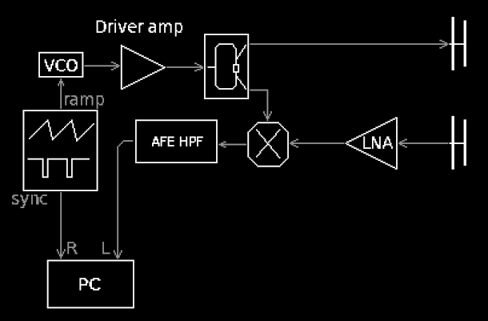

Chirp spectrum on a spectrum analyzer:

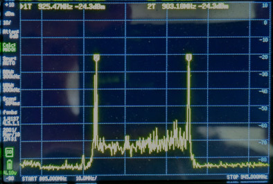

The sweep periodicity is set to approximately 100 Hz, with the sweep span being roughly 30 MHz. This gives a 3 GHz/sec chirp steepness. With c (speed of light) being approximately 300000 km/sec, the different target distances and associated IF frequencies can easily be calulated:

15m distance -> 30m roudtrip -> 100ns time of fligt -> 300Hz IF

150m distance -> 300m roudtrip -> 1us time of flight -> 3kHz IF

Since we're only detectig the magnitude of the IF frequencies (ignoring the phase) at approximately 100Hz steps, the theoretical resolution is 5m. 
The audio interface can reliably record frequencies up to at least ~15kHz, which gives a theoretical range of ~750 m (1/2 mile).

#### Estimating the noise- and ADC limited range

First we must make some assumptions about the target - for simplicity, let's assume that it can be modeled as an antenna with +9 dBi gain (same as what we're using in this radar) and that it reflects 100% of its received power back. Tx power of the radar is +7 dBm; we need approximately 20 kHz bandwidth for analog processing and the LNA has approximately 2.5 dB noise figure; this brings the minimum level at the input of the LNA to approximately -128 dBm. Both (Tx and Rx) antennas have approximately +9 dBi gain. Calculating with Friis path loss for each path (out and return) gives a noise-limited range of approximately 500m.

The ADC of the audio interface is recording with 16 bit resolution. For 1Vpp full signal level, the magnitude of one symbol out of 65536 is approximately 15 uVpp, which translates to -92 dBm signal level, which can easily be reached with the combined gain of the LNA (+18 dB) and the analog front-end (> +80 dB above 3kHz).

### Components

#### VCO

The VCO is a Colpitts type varicap-tuned dsicrete transistor oscillator with buffered output, designed to operate between roughly 800MHz and 1GHz. Its output level is relatively flat across the band, at +2dBm.

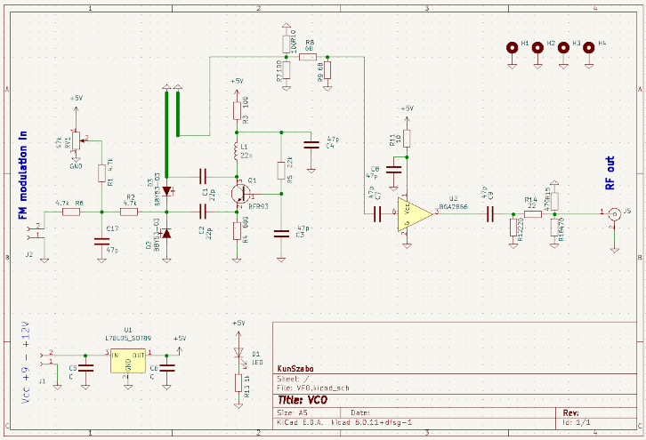

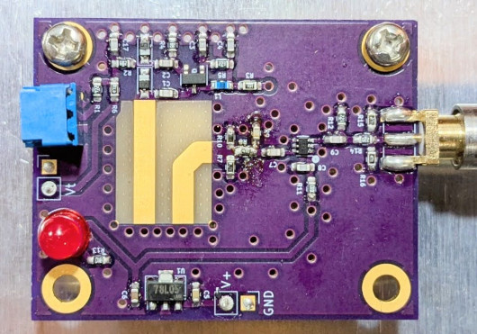

#### Ramp waveform generator

The ramp generator is a Miller-integrator & Scmitt-trigger based circuit that produces a linear sawtooth waveform, as well as a sync signal that is used by the processing algorithm to detect the sweep starts and ends.

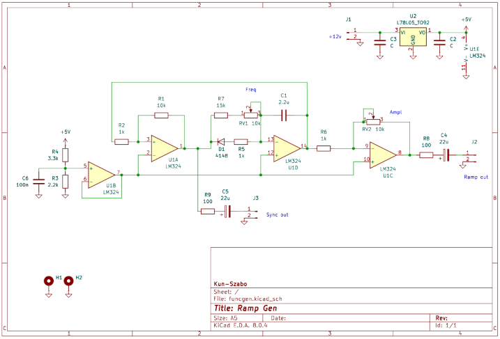

Ramp and sync signals:

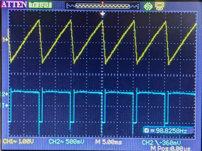

#### Analog frontend

Since received RF signal experiences spherical expansion (Friis path loss) twice during its time in flight (once when transmitted by the transmitter antenna, and once when reflected back from a small, point-like object), the reflected signal strength of an object that was repositioned at double distance is only 1/16 of what the radar would receive when the object was at 1/2 distance. This has to be compensated for.
Luckily, since increasing distance translates directly to increasing IF frequency, a compensation can easily be implemented in the analog frontend, in the form of a 2nd order (40 dB/decade) high-pass filter.

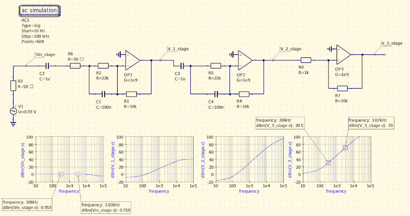

#### Driver amplifier and Antenna LNA

The driver amplifier is a [DIY balanced amplifier](https://github.com/szoftveres/RF_Microwave/tree/main/Amplifier/cascode), capable of delivering +10 dBm into the Wilkinson splitter - the Mini-Circuits ADE-5+ mixer used in this project requires +7 dBm LO power.

The antenna amplifier LNA is the [DIY cascode antenna amplifier](https://github.com/szoftveres/RF_Microwave/tree/main/Amplifier/cascode), which has an integrated bias-tee and therefore can be placed directly at the antenna and powered through the RF coax cable.

#### Antennas

There are some special requirements towards the antennas. On one hand, the radar can only look ahead at a narrow beam and its image is 1-dimensional, which calls for a beamforming antenna. On the other hand, good isolation between the transmitting- and receiving antennas is critical, the relatively high RF levels from the nearby transmitting antenna must not reach and overdrive the receiver LNA, mixer and analog front-end.

The antennas used here are two-element [DIY PCB Yagi](https://github.com/szoftveres/RF_Microwave/tree/main/em_antenna/915_pcb_yagi) arrays, spaced 1/2 λ apart and fed through Wilkinson-combiners. Since the two elements within one array interact with each other, the reduced feedpoint impedance is re-matched with L-match at each antenna element. This array arrangement has field strength nulls at perpendicular (90°) angles, as well as a 60° beam pattern ahead of the antenna.

Measured isolation between the Tx and Rx antennas is on the order of -40 dB when the antennas are side-by-side, only 1 m apart from each other:

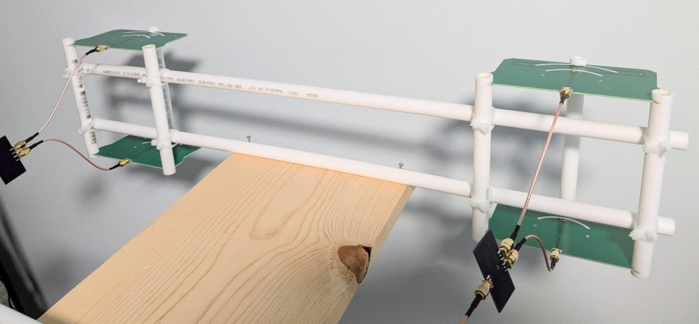

Simulated array factor and far-field pattern for one array:

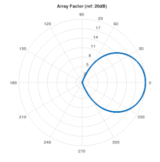

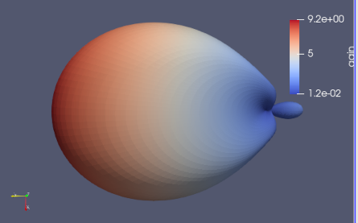

### Testing and processing

The initial testing was done on a straight section of street - several seconds long audio recordings were made when a vehicle was passing by.

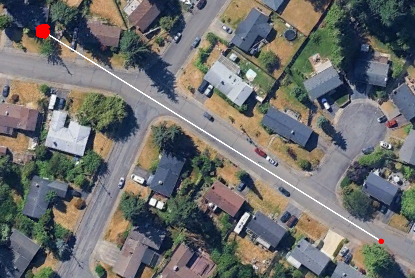

The [processing script](https://github.com/szoftveres/RF_Microwave/tree/main/radar/fmcw_process.m) detects each sweep (using the sync signal) and performs FFT on the samples. The resulting 2-dimensional image shows objects at various distances (Y-axis) as a function of time (X-axis).

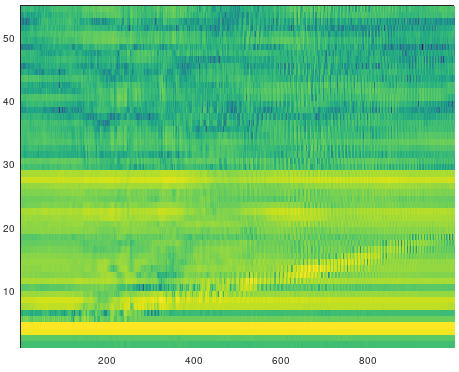

The image is mostly showing static frequency components (horizontal lines) from stationary reflecting objects (nearby buildings, etc..). These components can be characterized (e.g. by taking an initial measurement, or by calculating an average value for each component throughout the plot, etc..) and removed, resulting in an image that better highlights moving objects.

Radar image of a vehicle moving away from the radar, after static removal:

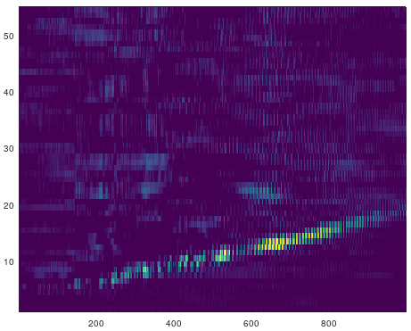

