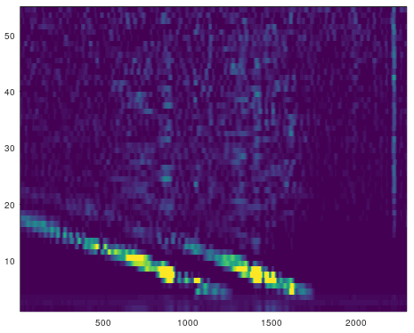

## Experimental FMCW Radar

The purpose of this experimental radar was to test out an easy-to-build, fully DIY (RF amplifiers, VCO, beamforming antennas, splitters, etc..) RF system as well as simple digital signal processing algorithms in GNU Octave.

### Architecture

Architecturally the radar is conventional (standard), operating in the 902-928 MHz frequency band. The analog (baseband and sweep sync) signals are fed into a stereo audio line-in interface of a PC, recorded and saved as 48kHz sample rate stereo WAV file. The WAV file is then processed by the [processing script](https://github.com/szoftveres/RF_Microwave/tree/main/radar/fmcw_process.m).

### Components

#### Ramp waveform generator

The ramp waveform generator produces periodic linear ramp waveforms, and a sync signal, which is being recorded and used by the DSP algorithm to detect the start- and stop of each sweep. The ramp amplitude (VCO tuning voltage level) control is also on this board, setting the FM sweep width of the radar.

Ramp and sync signals:

#### VCO

Ideally, the VCO has to be able to tune strictly linearly across the frequency range, following the tuning voltage, and provide flat power level across the band. Neither of these requirements can be achieved with a simple VCO like this one, however the fact that we're using only a small portion of the tuning range gives acceptable results.

The on-board trimmer (RV1) sets the center frequency of the oscillator anywhere between 800 MHz and 1 GHz, the microstrip coupler is designed for roughly 12dB coupling factor.

#### Driver amplifier

The driver amplifier amplifies the signal from the VCO, to where it's sufficient to drive the mixer through the Wilkinson splitter - the Mini-Circuits ADE-5+ mixer used in this project requires +7 dBm LO power, hence the driver amplifier has to be able to provide +10 dBm at its output. The other branch of the Wilkinson splitter either goes directly to the Tx antenna, or can drive a PA for more Tx output power.

The driver amplifier is essentially a balanced-amp version of the Rx antenna LNA (discussed below), it's covered on a [common design page](https://github.com/szoftveres/RF_Microwave/tree/main/Amplifier/cascode).

#### Antennas

There are some special requirements towards the antennas. First, ideally we'd want the radar to "see" at a narrow angle (because its image is 1-dimensional), which calls for a beamforming antenna. Then, good isolation between the transmitting- and receiving antennas is critical, the relatively high Tx RF levels must not be picked up by the nearby Rx antenna and overdrive the receiver LNA, mixer and analog front-end.

The antennas used here are two-element [DIY PCB Yagi](https://github.com/szoftveres/RF_Microwave/tree/main/em_antenna/915_pcb_yagi) arrays, spaced 1/2 λ apart, providing 60° beam width and better than 12dB front-to-back ratio.

The Tx and Rx bays are mounted on rods with their vertical nulls pointing toward each other; measured isolation between the two bays is better than -40 dB with this arrangement, only 60 cm apart from each other:

Simulated array factor and far-field pattern (OpenEMS) for one array:

#### Rx Antenna LNA

The role of the receiver antenna LNA is to overcome the noise contributions of the mixer, as well as to maintain linear amplification at the presence of a nearby powerful Tx signal source.

The design is covered in [this page](https://github.com/szoftveres/RF_Microwave/tree/main/Amplifier/cascode) (the above mentioned driver amplifier is also discussed on this page).

A long, lossy cable between the antenna and the LNA can degrade the Rx path noise figure due to cable losses, therefore the LNA features an on-board bias-tee, and is physically connected directly to the antenna RF output. Power is supplied through the coax cable via another bias-tee at the radar electronics side.

#### Analog frontend

The reflected signal experiences spherical expansion (a.k.a. Friis path loss) twice during its time in flight (first when on the way to the target and the second time when reflected back); consequently, moving a target twice as far away reduces the magnitude of the reflected signal to 1/16th of its original level. This has to be compensated for, distant objects should show up with the same intensity as nearby objects on the radar image. Also, feeding the baseband directly to the ADC without any pre-compensation would severely limit the magnitude (ADC quantizing) resolution of the faint echo signals from distant objects.

Distance translates directly to baseband frequency, so compensation can easily be implemented with a 2nd order (40 dB/decade) high-pass (pre-emphasis) filter on the baseband frequencies.

The analog frontend is also the main gain block before the ADC, the RF LNA is mainly used to overcome the noise contribution of the mixer.

### Build

Components mounted on an aluminum backplane:

#### Basic Parameters

The sweep periodicity is set to approximately 100 Hz (10ms period), with the sweep span being roughly 30 MHz. This gives a 3 GHz/sec chirp steepness. With given c (speed of light), the different target distances and associated baseband frequencies can easily be calulated:

15m distance -> 30m roudtrip -> 100ns time of fligt -> 300Hz baseband

150m distance -> 300m roudtrip -> 1us time of flight -> 3kHz baseband

The processing script gathers samples and runs FFT on the full length of each sweep, hence the FFT bucket resolution is 100Hz, giving a physical resolution of 5m / FFT bucket - roughly the length of a car - to this radar (the radar is only sensitive to the magnitude of the baseband frequencies and ignores the phase).
The audio interface can reliably record frequencies up to at least ~15kHz, which sets the analog bandwidth limited range to ~750 m (1/2 mile).

#### Estimating the noise- and ADC limited range

First, some assumptions have to be made about the target - for simplicity, let's assume that it can be modeled as an antenna with +9 dBi gain (same as what this radar is using for Tx and Rx antennas) that reflects 100% of its received power back. Tx power of the radar is +7 dBm; approximately 20 kHz bandwidth is needed for analog processing and the LNA has approximately 2.5 dB noise figure; this brings the minimum noise limited signal level at the input of the LNA to approximately -128 dBm at room temperature. Both (Tx and Rx) antennas have approximately +9 dBi gain. Calculating with Friis path loss for each path (out and return) gives a noise-limited range of approximately 500m.

The ADC of the audio interface is recording with 16 bit resolution. Relative to 1Vpp full signal level, the magnitude of one symbol out of 65536 is approximately 15 uVpp, which translates to -92 dBm signal level - this is the minimum detectable signal level by the ADC. When the previously calculated, -128dBm (noise-limit minimum level) signal reaches the LNA, it gets amplified sufficiently by the combined gain of the LNA (+18 dB) and the analog front-end (> +80 dB above 3kHz), at 7 dB mixer conversion loss, to easily surpass this level. Consequently, the ADC bit-resolution is not a factor.

### Testing and processing

Several seconds long audio recordings were made when vehicles were passing by on a straight residental street section.

The [processing script](https://github.com/szoftveres/RF_Microwave/tree/main/radar/fmcw_process.m) detects each sweep by the sync signal, and performs FFT on the samples. The Y-axis in the resulting 2-dimensional image is the distance, the X-axis is the time, and the color represents signal intensity.

The image is mostly showing static frequency components (horizontal lines) from stationary reflecting objects (nearby buildings, cars on driveways, etc..).

These components can be characterized (e.g. by taking an initial measurement, or by calculating an average value for each component throughout the X-axis, etc..) and removed, resulting in an image that better highlights moving objects:

Two cars arriving after each other:

### Testing #2

The next testing was done at a viewpoint, where more car traffic could be captured. 

The raw measurement shows two prominent radar echoes; the first one coming from a steel wire fence roughly 20m from the radar antenna, down below (#4 mark on the Y axis) and the second one from a large road sign, at 150m distance (#22 mark on the Y axis). These two obstacles pretty much frame the captureable range to ~150m, as they shadow out the range ahead- and behind them.

Removing the static components and post-processing unveils the moving vehicles. Cars appear from roughly the #10 mark (60m distance), where the slope and the steel wire fence don't block the signal any more, to the #30th mark on the Y axis (190m from the radar), as the radar signals pass underneath the road sign and reach so far before hitting the road surface. Unfortunately there's not much return from beyond the road sign, which is a major obstacle for the radar at this location.

## Synthetic Aperture Radar Imaging

### Simulation

In the below virtual "field", every pixel is equally reflective; the radar scans through this scenery on the lower horizontal (X) axis, from left to right.

After scanning, the result is stored in a 2-dimensional array, where X is the antenna location, Y is the range and the stored number is the intensity (and -later-, phase) that the radar picked up at that location. The distance between the antenna and a reflection point can be described with the Pythagorean distance, and follows a parabolid shape as a function of the antenna location; the point is closest to the antenna when they line up laterally with each other.

To simulate real-world conditions, the simulation includes a Gaussian antenna directivity, with maximum in the forward (vertical) direction; hence intensity from a point decreases as the antenna is displaced horizontally from a corresponding point:

The simplest way of creating a 2D image -based on radar echo intensity- is by projecting the individual echo circles in a 2D image space and highlighting the correlation; i.e. a pixel gets more brighter as more echo circles cross through it. Inherently, this process results in an image:

This -intensity based- image is still quite blurry and many features diminish. E.g. the small individual pixel in the upper right corner of the original "field" is almost invisible. The reason for blurriness of the image is that the above imaging algorithm considered an echo from an antenna location part of the pixel as long as the echo was "somewhere within the pixel", i.e. the accuracy and therefore the resolution of the correlation was limited by per-pixel geometry.

Another observation is that the block at the center of the image is brighter than the two -identical- blocks at the lower part of the image. This is due to the fact that objects farther away from the antenna scanning axis simply get more exposure time, due to the antenna radiation pattern.

The blurriness can be significantly improved if the phase is also made part of the imaging process. I.e. for each antenna location and distance point, the phase info (i.e. how far the radar echo is from the center point of a pixel, and the echo intensity, described as a complex vector) is saved as the antenna passes along the X-axis, and then during correlation process, the radar echoes are individually correlated with the same phase error from the center of a pixel. The resulting image is much better focused and even small details (like the individual pixel at the top right of the image) appear:

Animated process:

