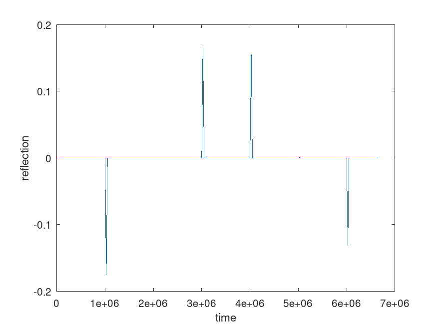
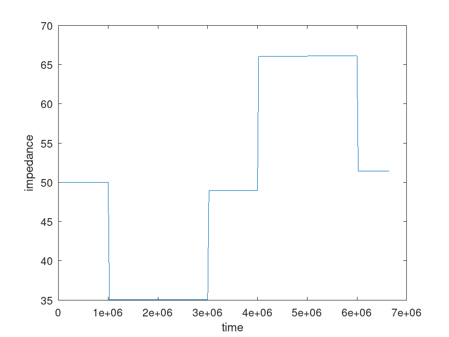

# Time Domain Reflection (TDR) simulation from S-parameters

It's known that time-domain fuctions can be transformed into frequency-domain *spectrum*, by applying Fourier-transform. Similarly, frequency-domain spectrum can be transformed back into a time-domain function, by inverse Fourier-transform.

Using the same analogy, *reflection* as a function of time can easily be obtained by applying inverse Fourier-transform on the frequency-domain *reflection coefficients* (S1,1), which are the direct result of a VNA S1,1 sweep.

Since the port impedance is known, time-domain reflection coefficient function can be further transformed into time-domain impedance function, which is useful for analyzing and spotting discontinuities in transmission lines.

[This script](tdr.m) simulates the S-parameters of a series of transmission lines (each having slightly different characteristic impedance and length), then applies inverse Fourier-transform on S1,1 to get the time-domain reflection. Finally, it calculates the time-domain impedance plot from the time-domain reflection plot, by integrating the former, as a function of time. 

Simulated network:

Time-domain reflection plot:

Time-domain impedance plot:

