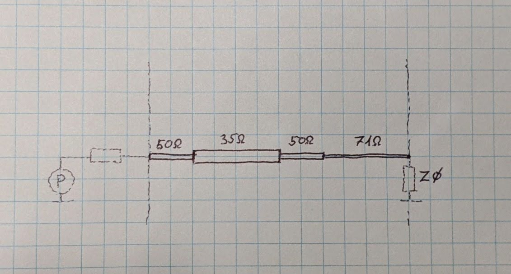
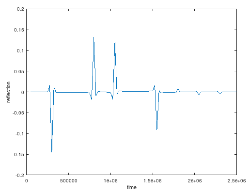
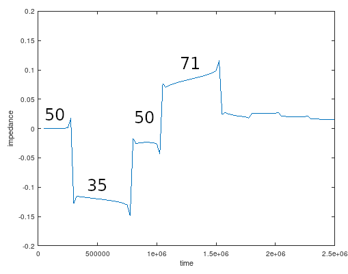

# Time Domain Reflection (TDR) simulation from S-parameters

It's known that time-domain signals can be transformed into frequency-domain spectrum, by applying Fourier-transform. Similarly, frequency-domain spectrum can be transformed back into time-domain, by inverse Fourier-transform.
Applying the same analogy, frequency-domain *reflection* can be transformed into time-domain reflection, by applying inverse Fourier-transform.
Frequency-domain reflection is readily available, as it is the direct result of a VNA S1,1 sweep.

This scripts simulates the S-parameters of a series of transmission lines, each having slightly different characteristic impedance and length, then applies inverse Fourier-transform to get the time-domain reflection. Finally, it calculates the time-domain impedance plot from the time-domain reflection plot, by integrating the former, as a function of time. 

Simulated network:

Time-domain reflection plot:

Time-domain impedance plot:

